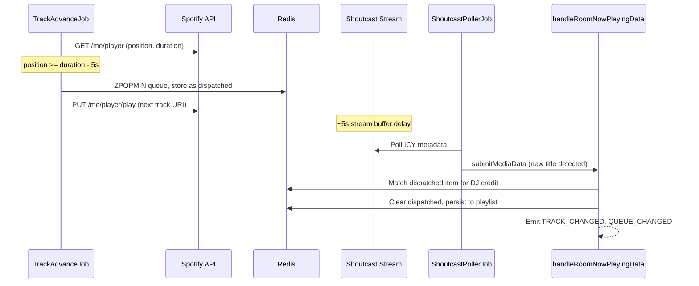

# App-Controlled Queue Advancement

## Context

Today, when a user queues a song in a radio room, `DJService.queueSong` stores it in the app queue AND pushes it to Spotify's queue via `playbackController.api.addToQueue()`. The app then passively observes what Spotify plays. This means Spotify's queue is authoritative and cannot be reordered or removed.

The new `playbackMode: "app-controlled"` makes the app queue authoritative. The app monitors Spotify's playback position and dispatches the next track when the current one ends, using `PUT /me/player/play`. Shoutcast remains the MediaSource (listeners hear audio through the stream, ~5s delayed), so Now Playing stays in sync with what they hear.

Today's queue is stored as a Redis **SET** of canonical keys (`mediaSource.type:trackId`) plus per-key JSON. Member order is undefined, so `getQueue` returns arbitrary order. Reordering for game mechanics requires a **canonical server-side order**. This plan replaces the SET with a Redis **sorted set (ZSET)** keyed by `room:{roomId}:queue_order`, using numeric scores for position. Members are unique (deduplication is free), `ZPOPMIN` gives an atomic "pop next", and reordering is just `ZADD` with a new score. The per-key JSON blobs (`room:{roomId}:queued_track:{trackKey}`) remain unchanged.

## Data Flow



## Changes

### 1. Add `playbackMode` to Room type

**[packages/types/Room.ts](packages/types/Room.ts)**

Add to the `Room` type:

```typescript
playbackMode?: "spotify-controlled" | "app-controlled"
```

Default is `undefined` (treated as `"spotify-controlled"` -- current behavior). This keeps it backward-compatible: no migration needed, existing rooms are unaffected.

### 2. Add "dispatched" Redis state and data operations

**[packages/server/operations/data/djs.ts](packages/server/operations/data/djs.ts)**

Add three new functions for the dispatched item:

- `setDispatchedTrack({ context, roomId, item: QueueItem })` -- Stores a single dispatched `QueueItem` at Redis key `room:{roomId}:dispatched_track` with a TTL (~60s safety net so it doesn't linger if something goes wrong).
- `getDispatchedTrack({ context, roomId })` -- Returns the dispatched `QueueItem` or `null`.
- `clearDispatchedTrack({ context, roomId })` -- Deletes the key.

These are thin wrappers around `context.redis.pubClient.set/get/unlink`, following the same patterns already in this file.

### 3. Ordered queue storage (Redis sorted set)

**[packages/server/operations/data/djs.ts](packages/server/operations/data/djs.ts)**

Replace `room:{roomId}:queue` (SET) with `room:{roomId}:queue_order` (ZSET). Members are `trackKey` strings (`${mediaSource.type}:${mediaSource.trackId}`), scores are numeric positions. Keep `room:{roomId}:queued_track:{trackKey}` JSON blobs unchanged.

**Score strategy:** Use `Date.now()` as the score on add (FIFO by default). Future game mechanics reorder by assigning new scores via `ZADD` -- no remove/reinsert needed.

**Operation mapping:**

- **`addToQueue`** -- `ZADD queue_order <Date.now()> <trackKey>` + `SET` JSON blob. ZSET rejects duplicate members automatically (score updates if re-added, but callers already prevent duplicates).
- **`getQueue`** -- `ZRANGE queue_order 0 -1`, then batch-fetch JSON blobs in returned order. Authoritative order; no client-side sort needed.
- **`removeFromQueue`** -- `ZREM queue_order <trackKey>` + `UNLINK` JSON blob. O(log N) removal from any position.
- **`clearQueue`** -- `ZRANGE` to get all members, `UNLINK` each JSON blob, then `DEL queue_order`. Same approach as today's `deleteMembersFromSet`.
- **`setQueue`** -- `DEL queue_order`, then `ZADD` each item with sequential scores, reconcile JSON blobs. Fix keying: use canonical `trackKey` everywhere (`setQueue` currently references `item.track.id` in places).

**Atomic pop for advance job:** Add `popNextFromQueue({ context, roomId }) -> QueueItem | null`:
1. `ZPOPMIN queue_order` -- atomically removes and returns the lowest-score member (next to play)
2. If result is empty, return null
3. Load JSON from `room:{roomId}:queued_track:{trackKey}`, `UNLINK` blob, return `QueueItem`

This is preferable to `getQueue()[0]` + `removeFromQueue` because `ZPOPMIN` is atomic -- no race between concurrent ticks.

**Lazy migration (startup-safe):** In `getQueue` (or a small `ensureQueueMigrated` helper called on first queue access per room):

1. If `queue_order` (ZSET) does not exist but legacy SET `room:{roomId}:queue` has members: load all `QueueItem` JSONs, sort by `addedAt` ascending, `ZADD` each `trackKey` with its `addedAt` as score, then `DEL` the old SET.
2. If both empty, no-op.

**Why sorted set over LIST:**
- `ZREM` by member is O(log N) vs LIST's `LREM` at O(N)
- Members are unique by definition -- deduplication is free (matches existing `sIsMember` check)
- Reordering = `ZADD` with a new score; no remove/reinsert dance
- `ZPOPMIN` atomically pops the next track -- no race conditions
- `ZRANK` gives a track's queue position (useful for future UI)
- Already used in this codebase for playlist history (`addTrackToRoomPlaylist` uses `zAdd`)

**Tests:** Update any tests that assume SET-specific behavior; add tests for ZSET order, `popNextFromQueue` atomicity, and legacy migration.

### 4. Create the track advance job

**New file: [packages/adapter-spotify/lib/trackAdvanceJob.ts](packages/adapter-spotify/lib/trackAdvanceJob.ts)**

A `JobRegistration` that polls Spotify's player state (reusing the existing `SpotifyApi.withAccessToken` + token refresh pattern from [playerQueryJob.ts](packages/adapter-spotify/lib/playerQueryJob.ts)):

- **Cron:** `*/3 * * * * *` (every 3 seconds, matching Shoutcast poller cadence)
- **Logic per tick:**
  1. Call `spotifyApi.player.getPlaybackState()` to get `progress_ms`, `item.duration_ms`, `is_playing`
  2. If not playing or no item, return early
  3. If `progress_ms >= duration_ms - ADVANCE_THRESHOLD_MS` (e.g., 5000ms):
     - Check if a track has already been dispatched (`getDispatchedTrack`) -- if so, skip (idempotent guard)
     - Pop the next item: `popNextFromQueue` (`ZPOPMIN` -- lowest score is always "next")
     - If queue is empty, do nothing (Spotify will stop naturally, or a plugin could handle "empty queue" behavior later)
     - Store the popped item via `setDispatchedTrack` with a 60s TTL
     - Emit `QUEUE_CHANGED` (queue shrinks immediately for all listeners)
     - Call `spotifyApi.player.startResumePlayback(deviceId, { uris: [resourceUrl] })` using the track's resource URL from `item.track.urls`
  4. On error, log and continue (fail-open; next tick retries)

The `ADVANCE_THRESHOLD_MS` constant should be tunable. 5 seconds gives a comfortable buffer for API latency while staying well within the Shoutcast delay window.

### 5. Modify `handleRoomNowPlayingData` to check dispatched state

**[packages/server/operations/room/handleRoomNowPlayingData.ts](packages/server/operations/room/handleRoomNowPlayingData.ts)**

In the `findQueuedTrack` function (called around line 136), the app queue match will fail because the track was already removed from the queue at dispatch time. Add a new strategy **before** the existing three:

- **Strategy 0 (app-controlled mode only):** Call `getDispatchedTrack({ context, roomId })`. If it exists and matches the submission (by `mediaSource.trackId` or by metadata source IDs / fuzzy match, reusing the same logic), return it as the match. Then `clearDispatchedTrack` after use.

This preserves the existing flow: `queuedTrack` is found (from dispatched state), DJ credit (`addedBy`) is preserved, `playedAt` is set, track is added to playlist with attribution, and `TRACK_CHANGED` fires.

The function needs access to the room's `playbackMode` to know whether to check dispatched state. The `room` object is already available in the parent function scope; pass it (or a boolean flag) to `findQueuedTrack`.

Since the track was already removed from the queue at dispatch time, the `removeFromQueue` block at line 221 will be a no-op (the `queuedTrack` came from dispatched, not from queue). Wrap that block with a guard: only call `removeFromQueue` if the item was found in the actual queue, not from dispatched state. Add a `source: "queue" | "dispatched"` discriminator to the return from `findQueuedTrack` to make this clean.

### 6. Modify `DJService.queueSong` for app-controlled mode

**[packages/server/services/DJService.ts](packages/server/services/DJService.ts)** (around line 177-214)

When the room's `playbackMode === "app-controlled"`:

- **Skip** the `playbackController.api.addToQueue(resourceUrl)` call entirely. The track stays only in the app queue.
- The rest of the flow (plugin validation, metadata lookup, `addToQueue`, `QUEUE_CHANGED` emission) stays the same.

Add a room lookup (already happens at line 120) and branch on `room.playbackMode`.

### 7. Conditionally register the advance job vs queue sync job

**[packages/adapter-spotify/index.ts](packages/adapter-spotify/index.ts)** -- `playbackController.onRoomCreated`

Currently registers `queueSyncJob` for all rooms. Change to:

- If `playbackMode === "app-controlled"`: register the new `trackAdvanceJob` instead of `queueSyncJob`
- Otherwise: register `queueSyncJob` as today

This requires the `onRoomCreated` callback to know the room's `playbackMode`. The callback already receives `roomId` and `context`, so it can do a `findRoom` lookup (this is what the Shoutcast adapter does).

The `onRoomDeleted` handler should clean up whichever job was registered (add `track-advance-{roomId}` to the cleanup).

### 8. Add `TRACK_DISPATCHED` system event (optional but recommended)

**[packages/types/SystemEventTypes.ts](packages/types/SystemEventTypes.ts)**

```typescript
TRACK_DISPATCHED: (data: {
  roomId: string
  track: QueueItem
  queue: QueueItem[]
}) => Promise<void> | void
```

Emitted by the advance job after dispatching. Plugins can listen for this (e.g., "next up" announcements, game mechanics that react to upcoming tracks). This is not strictly required for the core flow but opens up the game mechanic opportunities that motivate this change.

### 9. Wire up the room settings toggle

The `setRoomSettings` handler in [adminHandlersAdapter.ts](packages/server/handlers/adminHandlersAdapter.ts) already accepts `Partial<Room>` and persists via `AdminService`. Since `playbackMode` is just a new field on `Room`, it flows through automatically.

When `playbackMode` changes on a live room, the advance job or queue sync job needs to be swapped. Handle this by listening for the room settings update and re-running the playback controller's `onRoomDeleted` + `onRoomCreated` cycle (this already exists for other adapter lifecycle changes), or more simply: have both jobs check the current `playbackMode` on each tick and no-op if they're not the active mode. The latter is simpler and avoids lifecycle orchestration.

## Files Changed (summary)

- `packages/types/Room.ts` -- Add `playbackMode` field
- `packages/types/SystemEventTypes.ts` -- Add `TRACK_DISPATCHED` event
- `packages/server/operations/data/djs.ts` -- ZSET-based ordered queue + lazy migration; dispatched track ops; `popNextFromQueue`
- `packages/adapter-spotify/lib/trackAdvanceJob.ts` -- **New** -- timer-based queue advance job
- `packages/adapter-spotify/index.ts` -- Conditional job registration in `onRoomCreated`/`onRoomDeleted`
- `packages/server/operations/room/handleRoomNowPlayingData.ts` -- Check dispatched state in `findQueuedTrack`
- `packages/server/services/DJService.ts` -- Skip Spotify queue push in app-controlled mode

## What Stays Unchanged

- Shoutcast MediaSource adapter and its polling job
- `handleRoomNowPlayingData` core flow (enrichment, playlist, events)
- All frontend queue/playlist UI (still receives `QueueItem[]`; order becomes deterministic)
- Plugin hooks (`TRACK_CHANGED`, `QUEUE_CHANGED`)
- Room creation flow (default is `spotify-controlled`)
- Public `getQueue` API shape unchanged (ordered array)

## Risks and Mitigations

- **Dispatched item TTL expiry:** If Shoutcast never detects the track (e.g., stream encoding issue), the dispatched item expires after 60s and DJ credit is lost. Mitigation: the advance job can also call `submitMediaData` with enriched Spotify data as a fallback if dispatched TTL is approaching and `handleRoomNowPlayingData` hasn't cleared it. This is a future enhancement.
- **Score precision for reordering:** `Date.now()` scores work for FIFO. Future game mechanics that need arbitrary reordering can assign fractional scores between existing members or rebucket all scores. If sub-millisecond ordering matters, append a counter suffix. This is a follow-up concern.
- **Migration edge cases:** If a room has legacy SET only, migration runs on next queue access. If Redis has partial state (ZSET + SET both present), define precedence: if ZSET has members, treat as migrated and delete SET. Otherwise migrate SET to ZSET. Document in code comments.
- **Polling granularity:** 3-second poll interval means worst-case 3s of dead air (track ends right after a poll). The `ADVANCE_THRESHOLD_MS` of 5s compensates: the job dispatches early enough that even with 3s poll jitter + API latency, the next track starts before the current one ends.
