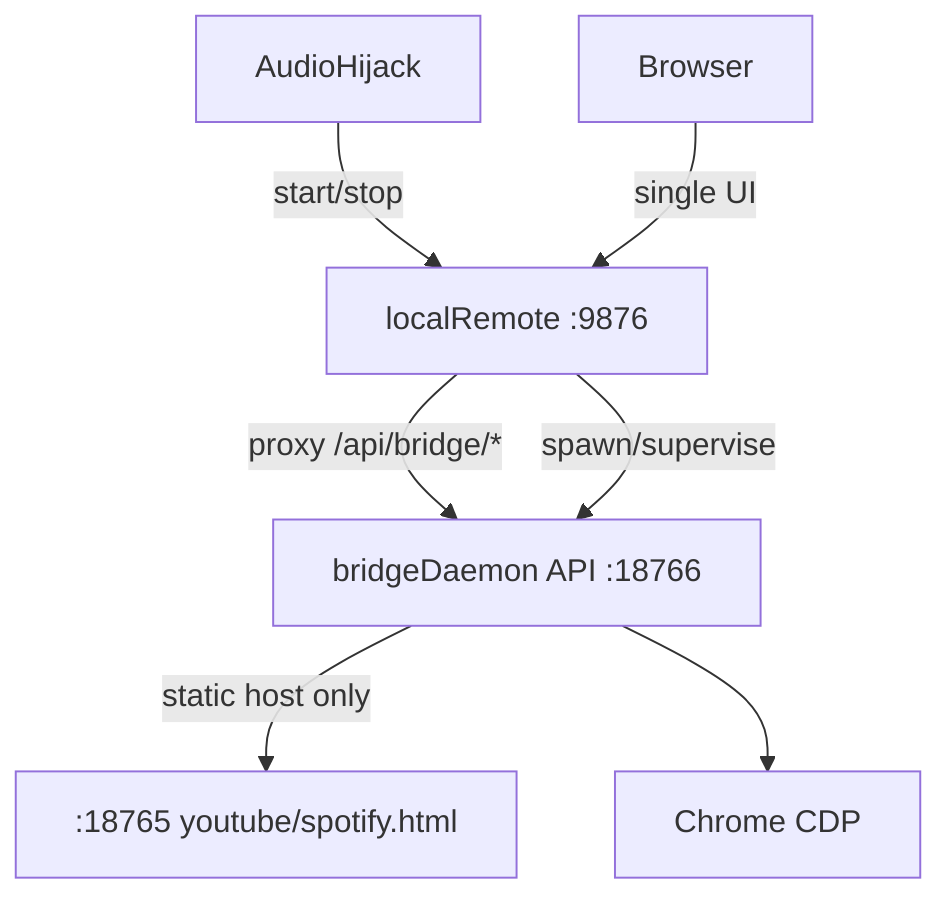

# Combined DJ Mac Release (Intel x86_64) — Option B consolidated UI

## Goal

One zip for the **Intel** DJ Mac. Audio Hijack start/stop runs **only** `local-remote`. Operators use **one browser UI** at `http://127.0.0.1:9876/` for OSC, soundboard, Now Playing policy, **and** bridge session/rooms/services/Chrome/Tidal/local config.

Under the hood: two processes (Rust supervisor + Node bridge-daemon). No second settings tab the DJ must open. No Electron; no Rust port of CDP drivers.

**Hard requirement:** binaries are **x86_64-apple-darwin** (cross-build from Apple silicon).

## Operator model (Option B)



| Surface                            | Port            | Who uses it                                            |
| ---------------------------------- | --------------- | ------------------------------------------------------ |
| Consolidated settings + soundboard | **9876**        | DJ (only bookmarked URL)                               |
| Bridge JSON API                    | 18766 localhost | local-remote proxy only (not documented for operators) |
| Chrome host pages                  | 18765           | Chrome tabs (not human operators)                      |

**Rejected (Option A):** two UIs (`:9876` + `:18766`) with a “open bridge UI” link.

## Artifact layout

```
listening-room-dj-mac/           (zip: …-darwin-x64.zip)
├── local-remote                 # Rust x86_64 — AH entrypoint + sole operator UI
├── runtime/node                 # Node 22 darwin-x64
├── bridge-daemon/
│   ├── daemon.cjs
│   ├── package.json
│   ├── static/                  # required (Chrome pages)
│   ├── ui/                      # optional escape hatch; not linked from product UI
│   └── node_modules/puppeteer-core/
└── README.txt
```

Paths resolve relative to the `local-remote` executable.

## Config model

- **local-remote** remains source of truth for `redisUrl` and `roomId` (show filter / OSC). Injected into the child as `BRIDGE_REDIS_URL` / `BRIDGE_DEFAULT_ROOM_ID`.
- **Bridge-specific settings** (services, chrome, tidal, navidrome, mpv, nowPlayingPath, defaultRoomId for bridge connect) stay in `~/.config/listening-room-bridge/config.json`, edited **only through the consolidated UI**, which `PUT`s via the proxy to the child’s existing `/api/config`.
- When `features.bridge.enabled` is true: auto-disable local-remote `features.nowPlaying` (bridge owns Now Playing.txt). UI shows a single Now Playing path control that maps to the bridge config field.

## Consolidated UI contents (guarantees)

**Additive** to the existing local-remote page — do not remove OSC / segment-map / soundboard surfaces.

### Retained from local-remote today

| Surface                                                                              | Where         | Status                                                               |
| ------------------------------------------------------------------------------------ | ------------- | -------------------------------------------------------------------- |
| Redis / room filter / platform API URL                                               | `/` settings  | Retained                                                             |
| **OSC + segment id → Farrago path mapping** (add/remove rows, tile picker, OSC test) | `/` settings  | **Retained**                                                         |
| **Farrago soundboard** (sets/tiles play/stop, WS live updates)                       | `/soundboard` | **Retained** (same origin `:9876`)                                   |
| local-remote Now Playing watcher                                                     | `/` settings  | Retained but **auto-off when bridge enabled** (bridge owns the file) |

### Added from bridge-daemon config / session UI

Editable via `:9876` (proxied `PUT /api/bridge/config` → child’s `~/.config/listening-room-bridge/config.json`):

1. **Bridge** — enable, running/error status, restart; autoConnect
2. **Session** — connect / disconnect / drivers / spotify device id
3. **Rooms** — discover + connect (no room-id paste required)
4. **`services` list** — checkboxes for `youtube` / `local` / `tidal` / `spotify` (the array in bridge `config.json`)
5. **Other important bridge fields** — `defaultRoomId`, Chrome (`executablePath`, `userDataDir`, `debuggingPort`), Tidal paths/ports, Navidrome url/user/pass, mpv path/socket, `nowPlayingPath`
6. Redis for the bridge child is **not** a second editable field — injected from local-remote’s `redisUrl` (`BRIDGE_REDIS_URL`)

Bridge’s standalone `ui/index.html` on `:18766` is an optional escape hatch only; product UI never links to it.

## API surface (local-remote)

New Axum routes in [apps/local-remote/daemon/src/api.rs](apps/local-remote/daemon/src/api.rs) that forward to the child (reqwest or hyper client):

| local-remote                  | child                                   |
| ----------------------------- | --------------------------------------- |
| `GET/PUT /api/bridge/config`  | `/api/config`                           |
| `GET /api/bridge/status`      | `/api/status`                           |
| `GET /api/bridge/rooms`       | `/api/rooms`                            |
| `POST /api/bridge/connect`    | `/api/connect`                          |
| `POST /api/bridge/disconnect` | `/api/disconnect`                       |
| `POST /api/bridge/restart`    | supervisor-local (kill + respawn child) |

If the child is down, proxy returns `503` with supervisor `lastError`. Do not require the DJ to hit `:18766`.

## Phases

### Phase 1 — Bundle bridge-daemon for stock Node

- `apps/bridge-daemon/scripts/bundle.mjs` → `dist-bundle/daemon.cjs` (CJS, externalize `puppeteer-core`), copy `static/` (+ `ui/` for escape hatch), `puppeteer-core`.
- Asset-path helper for CJS (`BRIDGE_STATIC_DIR` / relative `__dirname`) in configServer + staticHost.
- Env overrides: `BRIDGE_REDIS_URL`, `BRIDGE_DEFAULT_ROOM_ID`, `BRIDGE_MPV_PATH`.
- Keep JSON API on `httpListen` (default `127.0.0.1:18766`). Operator HTML on that port is **not** the product surface; optional later flag to skip serving `ui/index.html` if useful.
- **Done:** stock Node runs `daemon.cjs serve`; `/api/status` and `/api/rooms` work; static host serves Chrome pages.

### Phase 2 — Supervisor + reverse proxy

- `features.bridge` in [apps/local-remote/daemon/src/config.rs](apps/local-remote/daemon/src/config.rs): `enabled`, `autoConnect`, `nodePath`/`daemonPath` (defaults relative), `childApiBase` default `http://127.0.0.1:18766`, backoff.
- `bridge_supervisor.rs`: spawn, health poll, restart, shutdown kill; status in `state.rs`.
- Wire `main.rs` + proxy routes in `api.rs` (table above).
- On enable: force `features.nowPlaying.enabled = false` when saving config (double-publish guard).
- **Done:** enabling bridge starts child; `/api/bridge/status` works from `:9876`; Ctrl+C / AH stop leaves no orphan Node.

### Phase 2b — Consolidated UI (v1 requirement)

- Port bridge fieldsets into [apps/local-remote/ui/index.html](apps/local-remote/ui/index.html); all fetches go to `/api/bridge/*` on the same origin.
- Room list + connect/disconnect live in this page (no “open bridge UI” CTA).
- Title/branding: e.g. “Listening Room DJ Mac” (or keep local-remote with a Bridge section) — call: rename page title to **Listening Room DJ Mac**, keep binary name `local-remote` for AH script stability.
- **Done:** a DJ can configure Redis, OSC, soundboard, enable bridge, pick a room, and edit Chrome/services without leaving `:9876`.

### Phase 3 — Intel pack script

- `scripts/pack-dj-mac.sh` + `npm run pack:dj-mac`:
  1. `cargo build --release --target x86_64-apple-darwin` for local-remote
  2. Pin-download Node **darwin-x64** + SHA256 → `runtime/node`
  3. Phase 1 bundle → `bridge-daemon/`
  4. Assemble zip + `README.txt` (AH snippets, quarantine note, “open http://127.0.0.1:9876/ only”)
- **Done:** zip runs on Intel Mac; only bookmark is `:9876`.

### Phase 4 — Docs + ADR

- New ADR (next free number): combined x64 artifact; **Option B single operator UI**; Node child supervised; Electron / true merge rejected.
- Update bridge packaging ADRs + [docs/BRIDGE_LOCAL_TESTING.md](docs/BRIDGE_LOCAL_TESTING.md) + [apps/local-remote/README.md](apps/local-remote/README.md).
- Explicit: **Navidrome and mpv are not bundled** — install separately if using local library; Chrome/Spotify/TIDAL/AH external.

### Phase 5 (optional) — CI

- `macos-14` workflow: rustup x64 target, pack, upload release zip.

## Risks

| Risk                                           | Mitigation                                                                                                       |
| ---------------------------------------------- | ---------------------------------------------------------------------------------------------------------------- |
| Proxy latency / child not ready on first paint | UI polls status; disable bridge controls until `running`                                                         |
| Duplicate Redis URL fields in UI               | Show Redis once at top (local-remote); bridge Connection fieldset omits redisUrl or shows read-only “from above” |
| Escape-hatch `:18766` confuses ops             | README: do not bookmark; product never links it                                                                  |
| Large UI merge in one HTML file                | Accept for v1 (matches local-remote pattern); split later if needed                                              |
| esbuild CJS asset paths                        | Phase 1 helper + smoke test                                                                                      |

## Non-goals

- Electron / menu bar
- True single-process merge (Option C)
- Bundling Navidrome, mpv, Chrome, Spotify, AH
- Notarized dmg / auto-update (manual zip replace)
- arm64 artifact (add later if needed)
