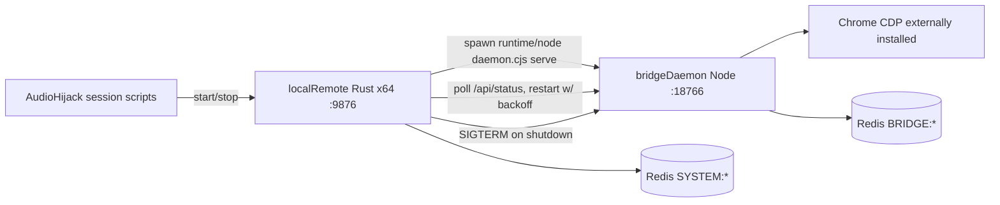

# Combined DJ Mac Release (Intel x86_64)

## Goal

One zip/folder installed on the **Intel** DJ Mac (no dev tools): Audio Hijack session scripts start/stop `local-remote` (Rust), which spawns and supervises a **bundled Node x64 runtime** running a **prebuilt `bridge-daemon`**. Config stays in existing browser UIs (`:9876` local-remote, `:18766` bridge). No Electron; no Rust port of the daemon.

**Hard requirement:** all binaries are **x86_64-apple-darwin**. Build machine is Apple silicon, so both builds cross-compile:
- Rust: `rustup target add x86_64-apple-darwin` + existing `build:intel` script in [apps/local-remote/package.json](apps/local-remote/package.json)
- Node runtime: download official `node-v22.x-darwin-x64.tar.gz` (pinned version + SHA256)
- `daemon.cjs` (esbuild) and `puppeteer-core` are pure JS — architecture-independent

## Artifact layout

```
listening-room-dj-mac/           (zip: listening-room-dj-mac-<ver>-darwin-x64.zip)
├── local-remote                 # Rust binary, x86_64
├── runtime/node                 # official Node 22 darwin-x64
├── bridge-daemon/
│   ├── daemon.cjs               # esbuild CJS bundle (entry: serve)
│   ├── package.json             # { "type": "commonjs" }
│   ├── ui/  static/             # control UI + youtube/spotify host pages
│   └── node_modules/puppeteer-core/
└── README.txt                   # install + AH wiring
```

Paths inside the supervisor resolve **relative to the `local-remote` executable** so the folder is relocatable.

## Architecture



## Phases

### Phase 1 — Bundle bridge-daemon for stock Node
- New `apps/bridge-daemon/scripts/bundle.mjs`: esbuild `src/index.ts` → `dist-bundle/daemon.cjs` (CJS, `packages: "bundle"`, externalize `puppeteer-core`), copy `ui/`, `static/`, and `node_modules/puppeteer-core/`; write `{ "type": "commonjs" }` package.json. Wire as the workspace `build` script.
- Asset-path helper (`src/assetPaths.ts`): resolve `ui`/`static` via `BRIDGE_UI_HTML` / `BRIDGE_STATIC_DIR` env or relative to the bundle (`__dirname` in CJS); use it in [apps/bridge-daemon/src/configServer.ts](apps/bridge-daemon/src/configServer.ts) and [apps/bridge-daemon/src/staticHost.ts](apps/bridge-daemon/src/staticHost.ts) (both currently use `import.meta.url`, which is empty in a CJS bundle).
- Env overrides in [apps/bridge-daemon/src/config.ts](apps/bridge-daemon/src/config.ts) `loadConfig()`: `BRIDGE_REDIS_URL`, `BRIDGE_DEFAULT_ROOM_ID`, `BRIDGE_MPV_PATH`.
- **Done:** `./node dist-bundle/daemon.cjs serve` on a stock Node (no tsx/monorepo) serves `:18766`, lists rooms from Redis, static host serves `spotify.html`/`youtube.html`.

### Phase 2 — local-remote bridge supervisor (Rust)
- `features.bridge` in [apps/local-remote/daemon/src/config.rs](apps/local-remote/daemon/src/config.rs): `enabled`, `autoConnect`, `controlUiUrl` (default `http://127.0.0.1:18766/`), optional `nodePath`/`daemonPath` overrides (default relative: `../runtime/node`, `../bridge-daemon/daemon.cjs`), `restartMaxBackoffSec`.
- New `apps/local-remote/daemon/src/bridge_supervisor.rs`: tokio task — spawn child (`kill_on_drop`), inject `BRIDGE_REDIS_URL` from local-remote `redisUrl`, poll `GET /api/status`, restart with exponential backoff, SIGTERM→SIGKILL on shutdown; status snapshot in [apps/local-remote/daemon/src/state.rs](apps/local-remote/daemon/src/state.rs).
- Wire into [apps/local-remote/daemon/src/main.rs](apps/local-remote/daemon/src/main.rs) (spawn + graceful shutdown) and [apps/local-remote/daemon/src/api.rs](apps/local-remote/daemon/src/api.rs) (`/api/status` gains `bridge: {...}`; `POST /api/bridge/restart`).
- UI fieldset in [apps/local-remote/ui/index.html](apps/local-remote/ui/index.html): enable toggle, status, link to `:18766`, warning that bridge owns Now Playing (auto-disable `features.nowPlaying` when enabling bridge — the ADR 0075 double-publish rule).
- **Done:** enabling bridge in the UI starts the child; killing local-remote leaves no orphan `node`; port-conflict on `:18766` surfaces `lastError` instead of a crash loop.

### Phase 3 — Intel pack script (single artifact)
- `scripts/pack-dj-mac.sh` + root script `pack:dj-mac`:
  1. `rustup target add x86_64-apple-darwin` (idempotent); `npm run build:intel -w local-remote`; copy `daemon/target/x86_64-apple-darwin/release/local-remote`
  2. Download pinned `node-v22.16.0-darwin-x64.tar.xz`, verify SHA256, extract `bin/node` → `runtime/node`
  3. Run Phase 1 bundle → `bridge-daemon/`
  4. Assemble `dist/listening-room-dj-mac/`, write `README.txt` (install path, AH start/stop script snippets, `xattr -dr com.apple.quarantine` note for unsigned binaries), zip as `…-darwin-x64.zip`
- **Done:** `npm run pack:dj-mac` on the arm64 build Mac produces a zip; `file` reports both binaries as `x86_64`; unzipped folder runs on the Intel Mac with only Chrome/AH/mpv installed.

### Phase 4 — Docs + ADR
- New ADR `docs/adrs/0078-dj-mac-combined-release.md` (confirm next number at implement time): Rust supervisor + bundled Node daemon, single x64 artifact, Electron rejected; update packaging bullet in [docs/adrs/0075-bridge-composite-playback-controller.md](docs/adrs/0075-bridge-composite-playback-controller.md), note in ADR 0077, row in [docs/adrs/index.md](docs/adrs/index.md).
- Update [docs/BRIDGE_LOCAL_TESTING.md](docs/BRIDGE_LOCAL_TESTING.md) (dev vs release artifact) and [apps/local-remote/README.md](apps/local-remote/README.md) (bridge feature).
- **Done:** a new operator can install from the zip + wire AH without the monorepo.

### Phase 5 (optional fast-follow) — CI workflow
- `.github/workflows/pack-dj-mac.yml` on `macos-14`: rustup x64 target, `npm ci`, `npm run pack:dj-mac`, upload zip as release asset. No signing secrets for v1 (quarantine note covers Gatekeeper).

## Risks
- **esbuild CJS `import.meta` breakage** — Phase 1 asset helper + env overrides; smoke-test the bundle under stock Node before packing.
- **Orphan Node child after AH force-kill** — `kill_on_drop` + process-group kill; document `pkill -f daemon.cjs` recovery.
- **Rust x64 cross-compile linker issues on arm64 host** — standard macOS toolchain handles `--target x86_64-apple-darwin` natively (no external linker needed); `build:intel` already exists.
- **Config drift (two config files)** — local-remote injects `BRIDGE_REDIS_URL`; bridge keeps its own `~/.config/listening-room-bridge/config.json` for everything else (no migration).

## Non-goals
- Electron, notarized `.dmg`, auto-update (manual zip replace for v1)
- Porting bridge-daemon to Rust; bundling Chrome/Spotify/AH/Navidrome; arm64 build (add later as a second pack target if ever needed)