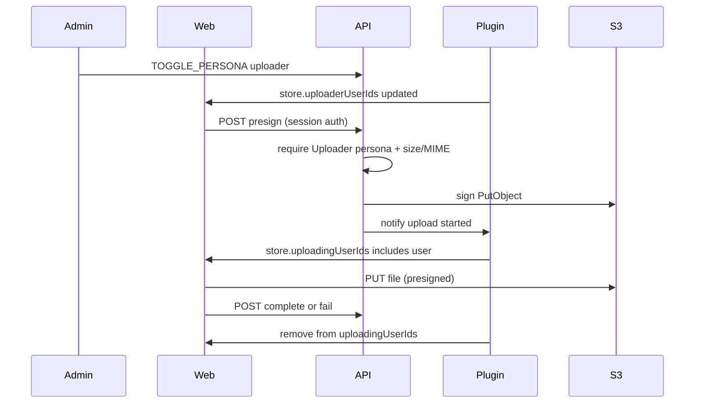

# Music Upload Plugin

## Goal

Admins can designate room users as **Uploaders** (persona). Designated users get UI to upload music files directly to the existing assets S3 bucket under a private `uploads/` prefix (username + date namespaced), max **800MB**, via **presigned PUT**. Files are not CDN-public and expire after **30 days**. Admins see when a user is actively uploading. Removing the persona does not cancel in-flight uploads.

## Stack and conventions

- Plugin package via `BasePlugin` ([ADR 0006](docs/adrs/0006-plugin-system-for-room-features.md)), registered in [`apps/api/src/server.ts`](apps/api/src/server.ts)
- Personas for durable roles ([ADR 0057](docs/adrs/0057-user-personas-system.md)) — **display/identity only**; authorize with `PersonaService` on the server
- Declarative plugin UI + `showWhen` membership ([ADR 0092](docs/adrs/0092-plugin-showwhen-membership-and-add-to-queue-area.md)); file picker is **core React** (plugins cannot host `<input type="file">`)
- Reuse AWS SDK / env pattern from [`AssetUploadService.ts`](packages/server/services/AssetUploadService.ts) and [`infra/cdn/`](infra/cdn/)
- New ADR **0098** for the private-upload boundary (plugin policy vs core transport vs CDN exclusion)

## Assumptions

- **Allowed types (v1):** common audio **plus archives** — audio: `audio/mpeg`, `audio/wav`, `audio/x-wav`, `audio/flac`, `audio/aiff`, `audio/mp4`, `audio/aac`, `audio/ogg`; archives: `application/zip`, `application/x-zip-compressed`, `application/x-rar-compressed`, `application/vnd.rar`, `application/x-7z-compressed` (plus matching extensions: `.mp3`, `.wav`, `.flac`, `.aiff`/`.aif`, `.m4a`, `.aac`, `.ogg`, `.zip`, `.rar`, `.7z`). Client `accept=` mirrors that list.
- **Object key:** `uploads/{sanitizedUsername}/{yyyy-mm-dd}/{userId}/{uuid}-{sanitizedFilename}` — username/date for SFTP browsing; `userId` avoids collisions when usernames collide.
- **Same bucket** as newsletter assets (`ASSET_S3_BUCKET`), private prefix; no `publicUrl` returned for music uploads.
- **Retrieval** is out of band (your SFTP/AWS tooling); the app never exposes download URLs.
- **Auth check at presign only** — once a URL is issued, PUT can finish even if the persona is removed mid-upload.
- Studio-bridge gets a minimal stub only if needed for Game Studio preview of the upload button area.

## In scope

- Infra: lifecycle expiration on `uploads/`; CloudFront GetObject **excluding** `uploads/*`; CORS origins for the web app; optional IAM note that Put covers `uploads/*` (already `/*`)
- Core: `MusicUploadService` + room-authenticated REST routes (presign + complete/fail)
- Plugin: `@repo/plugin-music-upload` with Uploader persona, config, component store for uploader roster + uploading ids, badge + open-upload action
- Web: core music upload UI (picker, progress, error) gated by persona / plugin store; wire progress start/complete to API so admins see status
- ADR 0098 + plugin registration

## Non-goals

- In-app playback of uploaded files, queue integration, or CDN delivery
- Multipart/resumable upload (single PUT; 800MB is within practical browser PUT range for this v1)
- SFTP/Transfer Family provisioning in Terraform
- Migrating chat/newsletter uploads
- Game modifiers / second “Uploading” persona

## Architecture



| Layer | Responsibility |
|-------|----------------|
| **Infra** [`infra/cdn/main.tf`](infra/cdn/main.tf) | 30-day lifecycle on `uploads/`; restrict CloudFront `Resource` to non-`uploads` keys (or dual statements: allow `newsletter/*` + `assets/*` only); expand `cors_allowed_origins` for web app |
| **Service** new `MusicUploadService` | Key builder, MIME/size validation, presign (no CDN URL), reuse S3 client/env from assets |
| **Routes** `POST /api/rooms/:roomId/music-uploads/presign` and `.../complete` (and fail) | Guest/session auth like images ([ADR 0022](docs/adrs/0022-rest-guest-authentication.md) / [0058](docs/adrs/0058-client-session-localstorage.md)); max body for JSON only; enforce persona via `PersonaService` |
| **Plugin** `packages/plugin-music-upload` | Register `uploader` persona (`assignableByAdmin`, `decoratesUser`); sync `uploaderUserIds` / `uploadingUserIds` in component store; badge on `userListItem`; button opens core upload UI |
| **Web** | Core `MusicUpload` control (mirror [`ImageUpload.tsx`](apps/web/src/components/ImageUpload.tsx) pattern): progress bar, XHR/`fetch` PUT with `Content-Length` / `Content-Type`; call complete/fail; show only when viewer ∈ `uploaderUserIds` |

**Why not modifiers for “uploading”:** modifiers require an active game session ([ADR 0042](docs/adrs/0042-game-sessions-and-inventory.md)). Plugin store + `userListItem` badge with `{ field: "uploadingUserIds", includes: "item.userId" }` works in any room and is visible to admins.

**Why not authorize solely via persona on the client:** ADR 0057 — server must re-check `plugin:music-upload:uploader` (or short id via Personas API) on presign.

**Revocation vs in-flight:** removing persona updates `uploaderUserIds` (hides controls) but does **not** clear `uploadingUserIds` or invalidate the already-issued presigned URL.

## Data model / API contract

**Presign request**

```ts
{ filename: string, contentType: string, contentLength: number }
```

**Presign response**

```ts
{ uploadUrl: string, key: string, uploadId: string, expiresIn: number }
```

No `publicUrl`. Cap: `contentLength <= 800 * 1024 * 1024`. Sign `PutObject` with `ContentType` and `ContentLength` so the browser must match. Presign TTL ~15–60 minutes (prefer **60m** for large files).

**Complete / fail**

```ts
{ uploadId: string, key: string } // fail may include reason
```

Server verifies the caller owns `uploadId` (Redis: `room:{roomId}:music-upload:{uploadId}` with userId, key, status, TTL ~2h). On start, plugin/API adds user to `uploadingUserIds`; on complete/fail/timeout cleanup, remove. Client should call fail on abort/error; server may expire Redis keys without relying on client for eventual cleanup of the badge.

**Plugin config (minimal):** `enabled` boolean; optional display copy. Max size fixed at 800MB in code (or config with hard ceiling 800).

**Component store keys:** `uploaderUserIds: string[]`, `uploadingUserIds: string[]`.

## Implementation phases

### Phase 1 — Infra: private `uploads/` + 30-day expiry

Intent: Objects under `uploads/` are not readable via CloudFront and auto-delete after 30 days; browsers on web origins can CORS PUT.

Files: [`infra/cdn/main.tf`](infra/cdn/main.tf), [`infra/cdn/variables.tf`](infra/cdn/variables.tf), [`infra/cdn/README.md`](infra/cdn/README.md), [`infra/cdn/terraform.tfvars.example`](infra/cdn/terraform.tfvars.example)

- Add `aws_s3_bucket_lifecycle_configuration` rule: prefix `uploads/`, `expiration { days = 30 }`
- Narrow CloudFront GetObject `Resource` to `…/assets/*` and `…/newsletter/*` (exclude `uploads/*`)
- Extend `cors_allowed_origins` defaults/docs for web app origins (local + prod)
- Document that music objects are private; retrieve via AWS CLI/SFTP tooling, not CDN

**Done means:** `terraform plan` shows lifecycle + policy/CORS changes; README documents the prefix contract.

### Phase 2 — ADR 0098 + core upload service/routes

Intent: Document the boundary and implement server-side presign/complete without a public URL.

Files: [`docs/adrs/0098-private-music-uploads-presign.md`](docs/adrs/0098-private-music-uploads-presign.md) (new), [`docs/adrs/index.md`](docs/adrs/index.md), new `packages/server/services/MusicUploadService.ts`, route module + mount in [`packages/server/index.ts`](packages/server/index.ts), types in [`packages/types`](packages/types), tests alongside service

- ADR: private prefix, persona auth at presign, plugin owns designation/UX state, core owns S3, no CDN for `uploads/`, revocation does not cancel PUT
- Service: sanitize filename/username; build key; validate MIME/extension (audio + zip/rar/7z) + size; `getSignedUrl` PUT; Redis upload session
- Auth: room member session (same pattern as image routes); require Uploader persona; reject if plugin disabled (check plugin config or always allow when persona exists — prefer: persona implies plugin registered/enabled)
- Do **not** return CloudFront URLs

**Done means:** unit tests for validation/key building; authenticated presign returns URL; unauthenticated / non-uploader get 403.

### Phase 3 — Plugin package

Intent: Uploader persona + store sync + declarative chrome.

Files: new `packages/plugin-music-upload/` (`index.ts`, `types.ts`, `schema.ts`, `package.json`), register in [`apps/api/src/server.ts`](apps/api/src/server.ts)

- Register persona: id `uploader`, label `Uploader`, icon `Upload`, `assignableByAdmin: true`, `decoratesUser: true`, `decoratesChatMessage: false` (or true if you want chat badge — default **user list only**)
- On register + `PERSONA_ASSIGNED` / `PERSONA_REMOVED`: refresh `uploaderUserIds` via `getUsersWithPersona`
- API for upload lifecycle: plugin method or system/plugin events from the route layer calling into the plugin registry / a small operation that updates store — keep route → operation → plugin emit pattern consistent with existing code
- Components: `userListItem` badge/icon when `uploadingUserIds` includes `item.userId`; `aboveChat` or room toolbar **button** with `showWhen: uploaderUserIds includes viewer.userId` that triggers opening the core upload UI (see Phase 4)
- `cleanup()` clears definitions (BasePlugin already unregisters personas)

**Done means:** assigning/removing Uploader via admin menu updates badges; store lists match persona holders.

### Phase 4 — Web upload UI + admin visibility

Intent: Real file picker/progress for uploaders; admins see uploading state on the user row.

Files: new component under `apps/web/src/components/` (e.g. `MusicUploadControl.tsx`), wire into room shell / plugin button handler, [`apps/web/src/lib/serverApi.ts`](apps/web/src/lib/serverApi.ts), possibly a small actor or local state (prefer local state + API like newsletter upload in scheduler)

- Button from plugin schema: use existing plugin `button` + client handler that opens a modal/drawer with file input (may require a tiny core bridge: e.g. listen for `PLUGIN:music-upload:OPEN_UPLOAD` or a known action id — match how other plugins open modals)
- Flow: pick file → validate size/type client-side → `presign` → set uploading (server) → `PUT` with progress → `complete` / `fail`
- `userListItem` badge from plugin schema is the admin-visible status (no modifier bars)
- Removing Uploader mid-upload: controls hide; PUT + progress UI for that user continue until complete/fail

**Done means:** designated user can upload a large audio or archive file to S3; another admin client sees uploading badge during PUT; after removal mid-upload, PUT still finishes; object is not fetchable via CDN URL.

### Phase 5 — Docs, studio-bridge touch-up, verification

Intent: Align docs and smoke-test paths.

Files: [`docs/PLUGIN_DEVELOPMENT.md`](docs/PLUGIN_DEVELOPMENT.md) or plugins index link if needed; [`infra/cdn/README.md`](infra/cdn/README.md); optionally [`apps/studio-bridge`](apps/studio-bridge) stub for button/store

**Done means:** package tests green; manual checklist in ADR/README (presign → PUT → lifecycle prefix; CloudFront 403/miss for `uploads/` key).

## Risks and tradeoffs

| Risk | Mitigation |
|------|------------|
| CloudFront currently allows GetObject on entire bucket — private uploads would leak by URL | Phase 1 narrows CF policy to non-`uploads` prefixes |
| Single PUT of 800MB may fail on flaky networks | v1 accept; document; multipart is a follow-up |
| Username optional / unstable | Sanitize; always include `userId` segment in key |
| Plugin button cannot host file input | Core React control + plugin action/event to open it |
| Badge stuck if client never calls complete/fail | Redis TTL + optional server cleanup job/timer clearing `uploadingUserIds` |

## Open questions

None blocking — allowed MIME set is common audio + zip/rar/7z (Phase 2 constants).