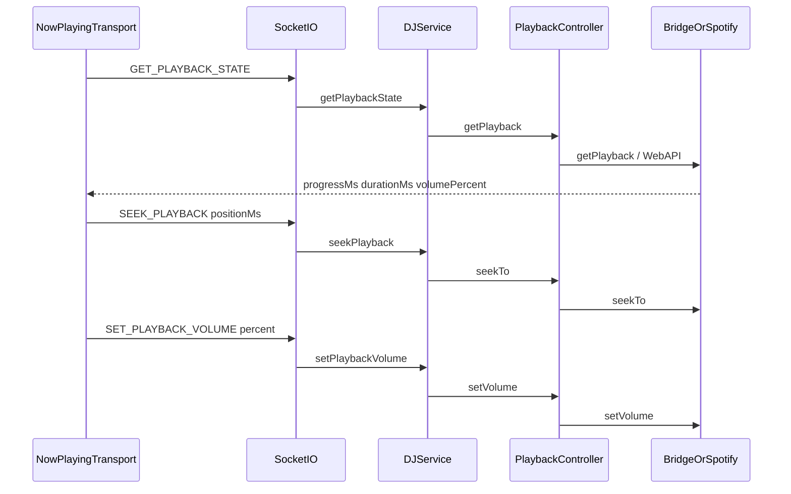

# Now Playing Seek and Volume Controls

## Goal

When Spotify playback moves to the bridge daemon (or local/mpv plays without a native player UI), room admins still need reliable **seek-within-track** and **live volume** controls. Add them as built-in UI under [`NowPlayingTrack.tsx`](apps/web/src/components/NowPlaying/NowPlayingTrack.tsx), not gated on the optional volume-manager plugin.

## Stack and conventions

- Socket handlers + `DJService` operations (mirror `TOGGLE_PLAYBACK` / `GET_PLAYBACK_STATE`)
- Admin/creator auth via `isRoomAdmin`; app-controlled rooms only (`isAppControlledPlayback`)
- Controllers already implement `seekTo` and optional `setVolume` ([`PlaybackControllerApi`](packages/types/PlaybackController.ts); bridge Redis RPC in [`playbackControllerApi.ts`](packages/adapter-bridge/lib/playbackControllerApi.ts); local mpv in [`local.ts`](apps/bridge-daemon/src/drivers/local.ts))
- Frontend: Chakra UI + existing [`sliderMachine`](apps/web/src/machines/sliderMachine.ts); follow ADR 0009/0010/0014
- New ADR **0074** for first-class transport Socket events vs plugin-only volume UI

## Assumptions

- **Seek within track** (not skip-to-next). Skip remains plugin/queue-owned.
- **Admin or room creator only**, same as queue-header play/pause.
- **Built-in live volume** always available when the controller supports `setVolume`. Volume-manager keeps segment/`startVolume` behavior; its Now Playing slider is removed/hidden to avoid double controls.
- Play/pause stays in [`QueuedTracksSection.tsx`](apps/web/src/components/QueuedTracksSection.tsx) for this pass.

## In scope

- Socket events: `SEEK_PLAYBACK`, `SET_PLAYBACK_VOLUME`
- Extend `GET_PLAYBACK_STATE` / `PLAYBACK_STATE` with `progressMs`, `durationMs`, `volumePercent`, `supportsVolume`
- Admin transport UI in Now Playing: scrubber + volume slider
- Hide volume-manager’s `nowPlayingInfo` slider
- ADR 0074 + studio-bridge stubs for the new events
- Server unit tests for the new DJService methods

## Non-goals

- Skip-to-next / previous buttons
- Listener-facing stream volume (already in `RadioControls` / `audioMachine`)
- Moving play/pause into Now Playing
- Audio Hijack bus volume scripting
- Deprecating volume-manager’s config / `beforePlayQueuedTrack` start-volume logic

## Architecture

### Server

| Piece                                                                                                                                | Change                                                                                                                                                                                                        |
| ------------------------------------------------------------------------------------------------------------------------------------ | ------------------------------------------------------------------------------------------------------------------------------------------------------------------------------------------------------------- |
| [`DJService`](packages/server/services/DJService.ts)                                                                                 | `seekPlayback(roomId, userId, positionMs)`, `setPlaybackVolume(roomId, userId, percent)`; same auth/mode gates as `togglePlayback`. Clamp volume 0–100; reject seek when no active track / negative position. |
| [`getPlaybackState`](packages/server/services/DJService.ts)                                                                          | Also return `progressMs`, `durationMs`, `volumePercent` (from controller or Redis `last_volume` for bridge), `supportsVolume: !!api.setVolume`.                                                               |
| [`djHandlersAdapter`](packages/server/handlers/djHandlersAdapter.ts) + [`djController`](packages/server/controllers/djController.ts) | Register `SEEK_PLAYBACK`, `SET_PLAYBACK_VOLUME`; success/failure event shapes.                                                                                                                                |
| [`PlaybackControllerApi.getPlayback`](packages/types/PlaybackController.ts)                                                          | Optional `volumePercent?: number \| null` on the return type.                                                                                                                                                 |
| Bridge `getPlayback`                                                                                                                 | Pass through driver `volumePercent` (today stripped). Spotify: read `device.volume_percent` from Web API state.                                                                                               |
| On successful `setVolume`                                                                                                            | Call existing `handlePlaybackVolumeChange` so volume-manager / Redis stay in sync.                                                                                                                            |

### Client

| Piece                                                                           | Change                                                                                                                                                                                                                                                                                                                       |
| ------------------------------------------------------------------------------- | ---------------------------------------------------------------------------------------------------------------------------------------------------------------------------------------------------------------------------------------------------------------------------------------------------------------------------- |
| New `NowPlayingTransport.tsx` (sibling under `NowPlaying/`)                     | Admin-only when `playbackMode === "app-controlled"`. Scrubber (seek on release) + volume slider (reuse `createSliderMachine`). Poll `GET_PLAYBACK_STATE` ~1s while mounted; interpolate progress locally while `state === "playing"` between polls. Hide scrubber if `durationMs` missing; hide volume if `!supportsVolume`. |
| [`NowPlayingTrack.tsx`](apps/web/src/components/NowPlaying/NowPlayingTrack.tsx) | Render `<NowPlayingTransport />` above or below `PluginArea nowPlayingInfo` (outside `LinkBox` so slider clicks don’t navigate).                                                                                                                                                                                             |
| Toasts                                                                          | Failure toasts for seek/volume, matching queue playback errors.                                                                                                                                                                                                                                                              |

### Volume-manager coexistence

- Remove or permanently hide the plugin slider in [`packages/plugin-volume-manager/schema.ts`](packages/plugin-volume-manager/schema.ts) (`nowPlayingInfo` slider).
- Keep config knobs + `beforePlayQueuedTrack` / `PLAYBACK_VOLUME_CHANGED` listeners for start-volume and segment presets.
- Built-in slider syncs from `PLAYBACK_STATE.volumePercent` on poll (and after `SET_PLAYBACK_VOLUME_SUCCESS`).

### Studio-bridge

Stub `SEEK_PLAYBACK` / `SET_PLAYBACK_VOLUME` and richer `PLAYBACK_STATE` in [`apps/studio-bridge`](apps/studio-bridge) so Game Studio preview doesn’t break.

## UX details

- Placement: compact row under track metadata, admin-only; not shown to deputies/listeners.
- Scrubber: show `mm:ss / mm:ss`; dragging pauses local interpolation; release emits `SEEK_PLAYBACK`.
- Volume: 0–100 icon slider; optimistic via `sliderMachine`.
- Distinct from listener stream volume — label/tooltip: “Show volume” / “Broadcast volume”.

## Implementation phases

### 1. ADR + types + controller volume in getPlayback

Document first-class `SEEK_PLAYBACK` / `SET_PLAYBACK_VOLUME` and extended `PLAYBACK_STATE`. Extend `getPlayback` return with optional `volumePercent`; wire Spotify + bridge.

**Done means:** ADR 0074 in index; types compile; bridge/Spotify `getPlayback` can return volume.

### 2. DJService + Socket handlers

Implement seek/volume ops + extended `getPlaybackState`; register on `djController`; unit tests for auth, clamping, happy path, missing controller.

**Done means:** `DJService` tests green; handlers emit success/failure events.

### 3. Now Playing transport UI

Add `NowPlayingTransport`, mount in `NowPlayingTrack`, poll + scrub + volume.

**Done means:** Admin in app-controlled room sees scrubber/volume; seek/volume hit the daemon/Spotify; non-admins see nothing.

### 4. Volume-manager slider hide + studio-bridge

Hide plugin slider; stub studio-bridge events; smoke-test notes in [`docs/BRIDGE_LOCAL_TESTING.md`](docs/BRIDGE_LOCAL_TESTING.md) (seek + built-in volume).

**Done means:** No double volume slider; studio-bridge compiles; local-test doc mentions the new UI.

## Risks and tradeoffs

| Risk                                  | Mitigation                                                          |
| ------------------------------------- | ------------------------------------------------------------------- |
| Poll latency / jumpy scrubber         | Local interpolation while playing; re-sync on poll; optimistic seek |
| Bridge `getPlayback` without volume   | Fall back to Redis `last_volume` / last successful set              |
| Dual volume UIs                       | Hide volume-manager slider                                          |
| Seek near track end races advance job | Same as Spotify today; accept ~1s job tick; no special lock in v1   |

## Open questions

None — seek-within-track confirmed; admin-only and built-in volume assumed as stated above.
