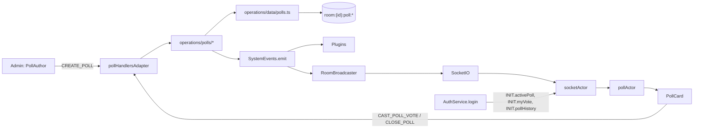

# Poll/Voting feature

Full plan saved to [`plans/poll-voting.md`](plans/poll-voting.md). Summary below; reflects the `/review-plan` session and all 11 resolved decisions.

## Decisions

- **Core, not plugin** — no multi-choice/results-bar primitive in `PluginComponentSchema`; plugin config is static Zod; per-user secrecy gating isn't a plugin primitive; polls are universal; snapshot integration is cleaner in core.
- **Persistence**: Redis only under `room:{roomId}:poll:*` / `room:{roomId}:polls:*`, wiped by `deleteRoom`. No PostgreSQL archive.
- **Single active poll** — `createPoll` returns 409-style error when one is already open.
- **No server-side drafts** — `pollStatusSchema` is `"open" | "closed"`. `createPoll` always publishes. Admin form autosaves to localStorage via `pollDraftPreference.ts`.
- **Votes are mutable, not revocable, no confirmation** — tapping a different option instantly swaps. Server uses single `HSET` overwrite (no MULTI, no Lua). `POLL_VOTE_CAST` fires only on first vote per user; swaps emit only the private `POLL_VOTE_CONFIRMED` (with `isSwap: true`) to preserve secret-ballot semantics.
- **Open-phase total**: per-poll `Poll.settings.hideRunningTotal: boolean`, **server-enforced**. `POLL_VOTE_CAST` payload is `{ pollId, totalVotes: number | null }` — `null` when hidden. Hidden-chip pulse still fires on boolean activity.
- **Admin moderation**: sealed in v1. Server retains `:votes` hash for future tooling.
- **Auto-close timer**: `closesAt` reserved in schema, unwired.
- **Max options**: no cap (only `min: 2`). PollCard becomes scrollable when `options.length > 8`. Chat results truncates to top 10 + "and N more". Reveal stagger total capped at ~480ms regardless of N.
- **Celebration**: no confetti, no sound. Reveal animation alone (staggered bars + count tween + winner badge bounce) carries the close moment. `pollPulse` screen effect on publish remains.
- **localStorage GC**: LRU cap at 100 entries via `radioroom:poll-display:index`. Same pattern for `pollDraftPreference.ts`.
- **PollCard placement**: above `ChatWindow` inside `Chat.tsx`. Per-user `expanded`/`collapsed`/`hidden` modes; `POLL_CLOSED` force-expands for reveal then restores preference.
- **UI delight**: anime.js v4 timelines in `apps/web/src/animations/<name>Animation.ts` (matching `coinGainButtonAnimation.ts` shape). Pure CSS for hover/press/collapse. All gated by `useAnimationsEnabled()`.
- **Chat on close**: server posts two messages — `meta.type: "alert"` banner + permanent full-results message via `formatPollResultsForChat(poll, results)` (pure helper, unit-tested).

## Architecture (data flow)



## Vote write (no MULTI, no Lua)

```text
status   = HGET room:{rid}:poll:{pid} status   →   reject if "closed"
isFirst  = HSET room:{rid}:poll:{pid}:votes {userId} {optionId}
                (1 = new field, 0 = overwrite)
total    = HLEN ... (only if isFirst && !hideRunningTotal)
```

Insert and swap are the same `HSET`. Idempotent. No tally counter to drift; per-option counts computed at close from `HGETALL :votes` + reduce. Results snapshotted once to immutable `:results` key.

## Wire events

- Public broadcast: `POLL_PUBLISHED`, `POLL_VOTE_CAST` (first-vote only; `totalVotes` may be `null`), `POLL_CLOSED` (full tallies + winners), `POLL_DELETED`.
- Private to caller (no `SystemEvents`): `POLL_VOTE_CONFIRMED` (with `isSwap` flag), `POLL_VOTE_FAILED` (with reason).

## Phases

1. **Types and events** — `packages/types/Poll.ts` (`PollSettings`, `PollResults` with `winners`), 4 `POLL_*` events, INIT/RoomSnapshot extensions.
2. **Redis data layer** — single-HSET `tryCastVote`, pure `reduceVotesToResults`, `writeResultsSnapshot` / `getResultsSnapshot`.
3. **Operations + admin gating** — `createPoll` always publishes; `castVote` returns `{ ok, isFirstVote, totalVotes }`; `closePoll` writes `:results` before emitting; `deletePoll` blocked while poll is active. `formatPollResultsForChat` pure helper.
4. **Handlers + controller wiring** — adapter relays `POLL_VOTE_CONFIRMED { pollId, optionId, isSwap }` and `POLL_VOTE_FAILED { pollId, reason }` to caller socket.
5. **INIT / ROOM_DATA snapshot extensions** — `activePoll`, `myVote` (live read from `:votes`), `pollHistory` (last 20 from `:results`).
6. **Web actor + machine** — `pollMachine` handles swap UX, optimistic-with-rollback, one-shot animation tracking via `seenAnimations`.
7. **PollCard UI** — three display modes with LRU-capped localStorage persistence; scrollable list when `options > 8`; anime.js animations (`pollMountAnimation`, `voteConfirmAnimation`, `voteTickAnimation`, `pollRevealAnimation`); `pollPulse` screenEffect; pure-CSS hover/press/collapse. Chat side server-driven via existing `MESSAGE_RECEIVED` → `SystemMessage` / `MessageSegments`.
8. **Admin authoring UI** — dynamic option list (no max), `hideRunningTotal` toggle, client-side draft autosave via `pollDraftPreference.ts`.
9. **ADR + docs** — `docs/adrs/0059-poll-voting-as-core-feature.md`, index update, studio-bridge stub.

## Key risks (full plan has more detail)

- `:results` write must succeed before `POLL_CLOSED` emits — operation does it in that order; failure returns error and event is not emitted.
- `hideRunningTotal` still leaks vote _timing_ via event existence — documented in ADR.
- Concurrent same-user swaps from two tabs: last-writer-wins; INIT reflects truth on reload.
- LRU index race in `pollDisplayPreference`: eventual consistency, documented.
- `HGETALL` on close scales fine to thousands of votes; HSCAN escape hatch for million-voter polls (not in scope).
