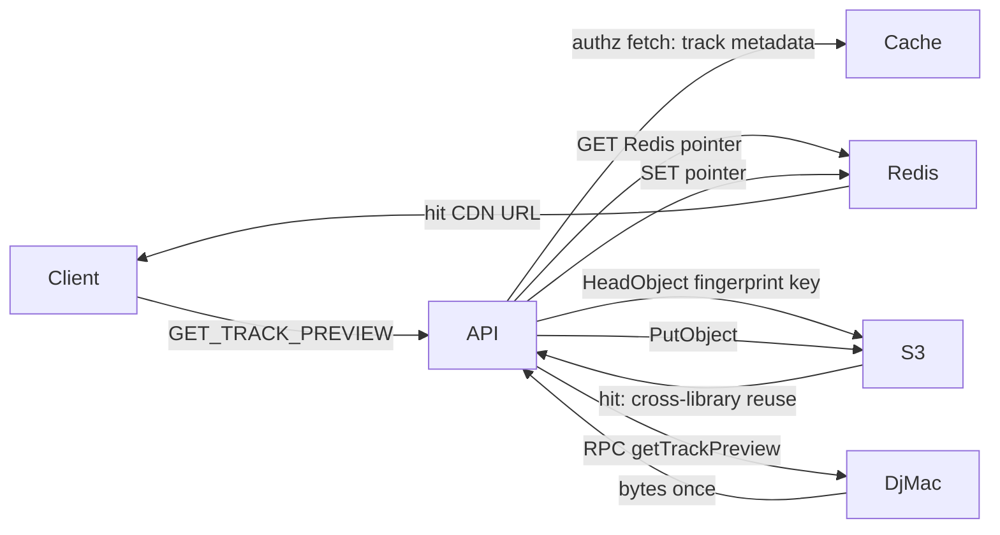

# Harden Redis: eviction, session TTL, S3 media

**Date:** 2026-09-18
**Revised:** 2026-09-18 after codebase verification (see _Review corrections_)

Redis is the show-critical store (room state, presence, Socket.IO adapter, SystemEvents). Production died because **base64 cover art and similar blobs** filled Heroku `maxmemory` (`noeviction` → every write OOM). This plan keeps Redis as a **coordination + URL pointer** layer and moves **all file bytes** to the existing asset bucket + CloudFront under **content-addressed keys**.

## Goal

Stop a live show from wedging when Redis is under memory pressure: set **`volatile-lru`**, add a **runtime guard** so an oversized value is refused instead of OOMing the instance, shrink long-lived `s:` sessions, ban new Redis blobs via the performance skill, and serve Physical Media covers, track previews, chat images, and room artwork from **S3 / CloudFront**, with Redis holding only small TTL'd URL pointers.

## Execution reference

Net-new patterns (content-addressing, S3 Head/Put, pointer records, size guard, RPC budget tests) are sketched in [`redis_oom_hardening_patterns.md`](redis_oom_hardening_patterns.md). Read it before writing code for phases 7–11.

## Design principle: DJ Mac is a music player first

The bridge daemon's job is decoding, playing, and broadcasting audio for a live show. Every RPC we send it competes with that — ffmpeg encodes, Navidrome `getCoverArt` fetches, and playlist walks all run on the same Mac that is mid-broadcast. So the target is not just "fewer Redis bytes" but **the daemon does each piece of media work once, ever**, and a reconnect mid-show costs Redis reads only.

This is why pointers are keyed by rescan-stable identity rather than Navidrome ids, why misses are cached as well as hits, and why TTLs are long and jittered.

## Stack and conventions

- Redis: [ADR 0003](docs/adrs/0003-redis-for-ephemeral-room-data.md). Sessions: `RedisStore` prefix `s:` in [`packages/server/index.ts`](packages/server/index.ts) (`maxAge` 1 year at `index.ts:149`, `resave: true` at `index.ts:143`). Guest `userId` is primarily [`clientSession` localStorage](docs/adrs/0058-client-session-localstorage.md), not the cookie.
- Images: [`packages/server/operations/data/images.ts`](packages/server/operations/data/images.ts) (`room:{id}:images:{imageId}` hashes, **no TTL anywhere in the file**). Chat/artwork via [`prepareRoomImage.ts`](packages/server/operations/data/prepareRoomImage.ts) + [ADR 0134](docs/adrs/0134-chat-image-server-processing.md). Album/playlist covers via [`PluginAPI.getLocalAlbumArtwork`](packages/server/lib/plugins/PluginAPI.ts) (`al-cover-` / `pl-cover-`, content-hashed by [`albumArtworkImageId`](packages/server/lib/plugins/PluginAPI.ts) / `playlistArtworkImageId`). Queue thumbs: [`rewriteLocalTrackImages.ts`](packages/server/operations/dj/rewriteLocalTrackImages.ts) (`qimg-<md5:12>`).
- Previews: [ADR 0103](docs/adrs/0103-physical-media-track-previews.md) — Socket.IO `GET_TRACK_PREVIEW` → bridge **RPC** (not pub/sub) → Redis base64, **4h TTL**, served at `GET /api/rooms/:roomId/track-previews/:previewId` ([`index.ts:268`](packages/server/index.ts)).
- S3 today: presigned PUT only ([`s3Presign.ts`](packages/server/lib/s3Presign.ts), [ADR 0119](docs/adrs/0119-private-music-uploads-presign.md)). Bucket/CDN env parsing already exists in [`AssetUploadService.ts`](packages/server/services/AssetUploadService.ts) (`getAssetBucket` / `getAssetCdnBaseUrl`). CloudFront may `GetObject` **`assets/*` and `newsletter/*` only** ([`main.tf:207-220`](infra/cdn/main.tf)); `uploads/` is private. IAM sender already has `s3:PutObject` on the whole bucket ([`main.tf:265`](infra/cdn/main.tf)).
- DJ Mac has **no AWS SDK**. Covers are Navidrome `getCoverArt` data URIs; previews are ffmpeg ~15s/64k MP3 ([`local.ts` `getTrackPreview`](apps/bridge-daemon/src/drivers/local.ts)).
- Bridge RPC rides **Redis pub/sub** ([`rpcClient.ts:96`](packages/adapter-bridge/lib/rpcClient.ts)), not the keyspace.

## Review corrections

Findings from verifying the first draft against the code. Each one changed the plan.

1. **`libraryId` from the Navidrome URL does not work.** [`config.ts:47-56`](apps/bridge-daemon/src/config.ts) defaults `navidrome.url` to `http://127.0.0.1:4533`, so every DJ Mac hashes identically — producing exactly the cross-library collision the mitigation was meant to prevent, and serving the **wrong audio** for a colliding `trackId`. Replaced by content-addressing (see _Architecture_); `libraryId` survives only for cover _pointers_, where a collision costs a wasted RPC rather than a wrong clip.
2. **`persistRoom` strips TTLs from every `room:{id}:*` key.** [`rooms.ts:573`](packages/server/operations/data/rooms.ts) sweeps [`getAllRoomDataKeys`](packages/server/operations/data/rooms.ts) (a `SCAN` of `room:{id}:*`) and `PERSIST`s each match; it fires on admin join ([`AuthService.ts:249`](packages/server/services/AuthService.ts)). Today that already strips the 4h preview TTL. Any room-scoped cache we add would become invisible to `volatile-lru`. Now its own phase.
3. **"Room keys have no TTL" was wrong.** [`cleanupRooms.ts:35`](packages/server/jobs/rooms/cleanupRooms.ts) calls `expireRoomIn` on idle rooms, so idle-but-alive rooms _do_ carry TTLs and _are_ `volatile-lru` eviction candidates. Accepted (those rooms are already scheduled for deletion) but stated explicitly rather than denied.
4. **Nothing in the original plan kept Redis up mid-show.** Every mitigation was design-time or migration. Added a runtime guard phase.
5. **Reclaiming the leaked bytes was listed as "optional."** `al-cover-*`, `pl-cover-*`, `qimg-*` and chat images have **no TTL**, so `volatile-lru` can never evict them and they never expire. The `SCAN`/`UNLINK` is the only step that frees the memory from the outage. Now a required phase.
6. **Ordering contradicted the diagnosis.** Previews already have a 4h TTL; covers and chat images have none. Covers now ship before previews.
7. **Pub/sub payload pressure.** A ~120KB clip or ~400KB cover crossing [`rpcClient.ts:96`](packages/adapter-bridge/lib/rpcClient.ts) costs no keyspace memory and `PUBLISH` is not OOM-rejected, but batched cover hydration can trip `client-output-buffer-limit pubsub`. Bounded in phase 9.
8. **Existing content hashes are too short to promote.** `al-cover` / `pl-cover` use md5 truncated to 8 hex chars (32 bits — birthday collisions near ~77k objects); `qimg-` uses 12. Fine for a per-room image id, **not** for a global cross-library S3 namespace. S3 keys use full sha256.

## Challenges to the proposed flow (and the recommended shape)

1. **Do not put AWS credentials on DJ Mac.** Bytes already arrive at the API on a cache miss (Redis RPC payload). **API `HeadObject` then `PutObject`** is v1. Presigned PUT from the daemon is a later optimization, not required for ~120KB clips / ~100–400KB JPEGs.
2. **Keep Redis RPC for generation.** ADR 0103 already uses RPC + a blocking socket request. Do not add a new PUB/SUB "preview ready" channel.
3. **Navidrome ids are library-local and rebuilt on rescan.** They are acceptable as a _lookup_ key (a miss is self-healing) and unacceptable as an _object_ key (a rescan would orphan every object and re-run ffmpeg across the catalog). Hence the two-key split below.
4. **`volatile-lru` only evicts keys that already have a TTL.** Today's OOM keys (`al-cover-*`, chat images) have **none**, so flipping the policy alone will not drop them — hence phase 12. After blobs leave Redis, remaining URL pointers and `s:` sessions _are_ TTL'd and become the correct eviction set, **provided phase 3 stops `persistRoom` from stripping those TTLs**.
5. **Shortening `s:` does not log guests out of identity.** [`clientSession`](apps/web/src/lib/clientSession.ts) keeps `userId` in localStorage; login still sends `incomingUserId`. Recommend **90-day cookie** for Redis memory only; do **not** wipe localStorage (inventory/game attribution).

Rejected: `allkeys-lru` (can evict `room:{id}:details` / queue mid-show). Rejected: library-scoped S3 keys (see correction 1). Rejected: content-hash of _clip bytes_ as the preview object key (chicken-and-egg before ffmpeg — the fingerprint is over source metadata instead). Rejected: API proxying bytes forever (defeats Redis relief and CDN).

## Assumptions

- Production Redis addon can set `maxmemory-policy` (`heroku redis:maxmemory-policy`). If the Mini plan blocks it, upgrade the addon as part of phase 1.
- Same asset bucket / `ASSET_CDN_BASE_URL` / sender IAM user; extend prefixes rather than a new bucket.
- Chat/artwork stay **unguessable public GET** (today's model), served as CloudFront URLs. Previews become public CDN objects with content-addressed keys (same trust as unguessable preview ids — the key is not a secret). Generation stays socket-authorized.
- Library media in S3 **persists across rooms and across libraries** (no lifecycle). Room-scoped chat objects may expire — **90-day lifecycle on `media/rooms/`**, none on `media/covers/` or `media/previews/`.
- 0186 TTL-in-Redis work stays dropped. No stopgap cover TTL; phase 2's runtime guard plus phase 12's reclaim cover the gap before S3 ships.

## In scope

- Heroku `volatile-lru` + document the command.
- Runtime blob guard + `used_memory` alerting.
- Express session `cookie.maxAge` **90 days** (connect-redis TTL follows).
- `persistRoom` / `expireRoomIn` TTL correctness for cache keys.
- Performance skill (both [`.cursor/skills/review-performance`](.cursor/skills/review-performance/SKILL.md) and [`.claude/skills/review-performance`](.claude/skills/review-performance/SKILL.md)): Redis blob / OOM checklist.
- ADR **0186** (number is free — 0185 is the highest): Redis is coordination + URL pointer; binaries in content-addressed S3.
- CloudFront + bucket policy for `media/*`; IAM `s3:GetObject`/`HeadObject` on `media/*`.
- Content-addressing module + API media cache helper: Redis URL pointer, S3 Head/Put, CDN URL.
- Migrate writers: album/playlist covers, queue thumbs, previews, chat + room artwork.
- Serve CDN URLs in payloads; keep existing HTTP routes as **302** during cutover.
- Reclaim legacy blobs after cutover.

## Non-goals

- AWS on the bridge daemon.
- Moving plugin JSON, queues, chat _text_, or sessions off Redis.
- Changing preview ducking / Howler / authz rules.
- Flushing production Redis in app code (ops, not a merge).
- Clearing `localStorage` guest ids.
- Changing the per-room image id format of ADR 0099 §8 (short md5 stays fine _inside_ a room; only S3 keys go to sha256).

## Architecture

### Two keys, two jobs

|                  | Lookup key                                      | Object key                            |
| ---------------- | ----------------------------------------------- | ------------------------------------- |
| Job              | "do I need to do work?"                         | names the bytes in S3                 |
| Computed         | before the RPC, from what the API already holds | from something intrinsic to the media |
| Stability needed | none — a miss is self-healing                   | total — a rescan must not orphan it   |
| Lives in         | Redis (small, TTL'd)                            | S3                                    |

Navidrome ids appear **only** in lookup keys.

### What is stable

- **`musicBrainzId`** — already read from OpenSubsonic ([`localTypes.ts:18`](apps/bridge-daemon/src/drivers/localTypes.ts)), already on playlist cache entries ([`localPlaylistCache.ts:43`](apps/bridge-daemon/src/drivers/localPlaylistCache.ts)), already used by [`publicUrlTags.ts:108`](apps/bridge-daemon/src/drivers/publicUrlTags.ts). Globally stable **when tagged** — frequently absent on ripped/live/bootleg material. **v2 alias, not v1.**
- **Track metadata** — `title`, `artists[].title`, `album.title`, `duration`, `trackNumber`, `discNumber` on [`metadataSourceTrackSchema`](packages/types/MetadataSource.ts). Intrinsic to the music, not to the Navidrome DB. **v1 fingerprint source.**
- **Cover bytes** — already content-hashed today; ADR 0099 §8 explicitly relies on that for idempotent re-derivation.
- **Navidrome ids** (`song.id`, `albumId`, `coverArt` → [`coverCacheKey`](apps/bridge-daemon/src/drivers/localCoverCache.ts)) — DB-local, rebuilt on rescan. Lookup only.

### S3 keys (no `libraryId`)

- `media/covers/{sha256(bytes)}/{sm|lg}.jpg`
- `media/previews/{sha256(fingerprint)}.mp3`
- `media/rooms/{roomId}/images/{sha256(bytes)}.jpg` (reuse [`hashRoomImageContent`](packages/server/operations/data/images.ts), which is already sha256)

`fingerprint` is a normalized join of `artist|album|title|discNumber|trackNumber|durationSec` — lowercased, whitespace and punctuation collapsed, duration rounded to the nearest second so re-rip jitter does not split the key.

### Redis pointers (small, TTL'd)

- `media:ptr:preview:{sha256(fingerprint)}` → `{ url, mimeType, durationMs }`, TTL 7d sliding
- `media:ptr:cover:{libraryId}:{sha256(identity)}:{variant}` → `{ url }` **or** `{ none: true }`, TTL 30d sliding for hits / 7d for negatives, jittered
- `room:{roomId}:images:{imageId}` becomes a **URL hash** (no `data` field), or chat messages store the CDN URL directly and the Redis image keys go away after cutover

Preview pointers need no `libraryId` — the fingerprint is the key at both levels. Cover pointers keep it because item identity is only unique within one library.

**Cover identity is deliberately not the Navidrome `coverKey`.** It is `sha256` of the normalized playlist name for prefixed-playlist records (`[LP] Artist - Album`), or of `artist|album` for album-derived ones. A rescan that moves Navidrome ids does not move it, so the pointer survives — which is the whole point, since `coverKey` ([`coverCacheKey`](apps/bridge-daemon/src/drivers/localCoverCache.ts): `coverArt` → `albumId` → `id`) is rescan-unstable. Staleness trade-off in phase 9.

**All pointer keys must sit outside the `room:` prefix** (or be excluded in phase 3), or `persistRoom` will strip their TTLs and defeat `volatile-lru`.

### Preview miss path

1. Redis pointer hit → return CDN URL.
2. Miss → fingerprint → `HeadObject` → hit → SET pointer, return. **This is where cross-library reuse and rescan self-healing happen, with no RPC and no ffmpeg.**
3. Miss → existing `fetchTrackPreview` RPC → `PutObject` → SET pointer → return.

**The fingerprint metadata is already in hand for free.** `getTrackPreview` receives only a `trackId` ([`trackPreview.ts:151`](packages/server/operations/dj/trackPreview.ts)), but the authz step above it already fetched the full track list: [`authorizeMediaItemTrackPreview`](packages/server/operations/dj/trackPreview.ts) calls `fetchResolvedMediaItemTracks` (through `context.cache`) and does `listed.tracks.some((t) => t.id === trackId)` at [`trackPreview.ts:140`](packages/server/operations/dj/trackPreview.ts). Change that `.some()` to `.find()` and the `MetadataSourceTrack` is available at zero extra cost on the Record Store / Collection path.

The catalog path ([`authorizeLocalCatalogPreview`](packages/server/operations/dj/trackPreview.ts)) does a membership check and never fetches metadata. Have `fetchTrackPreview` return the fingerprint fields alongside the clip — the daemon already holds the full `NavidromeSong` in `getTrackPreview` — and write the pointer after the fact.

**Refuse to fingerprint** when artist and album are both empty (placeholder-artist normalization already exists in [`mapSong`](apps/bridge-daemon/src/drivers/local.ts)). Fall back to an id-keyed pointer with no S3 sharing rather than risk a bad collision.

### Cover miss path

Asymmetric with previews, and the asymmetry is the reason phase 9 needs identity-keyed pointers.

The cover object key is `sha256(bytes)`, so you cannot `HeadObject` before you have the bytes — unlike previews, where the fingerprint is computed from metadata the API already holds. A cold pointer therefore means a **full daemon RPC**, even though the S3 object is already there and the `PutObject` gets skipped. S3 dedups the storage; only the pointer can spare the Mac.

So the pointer is the load-bearing cache for covers:

1. Identity pointer hit → return CDN URL. No daemon traffic. **This is the common path and must stay hot across reconnects, restarts, and rescans.**
2. Negative pointer hit (`{ none: true }`) → this record has no art. Return nothing, no RPC.
3. Miss → existing `getLocalAlbumCoverArt` / `getPlaylistCoverArt` RPC → hash bytes → `HeadObject` → `PutObject` only if absent → SET pointer (positive or negative).

`hydrateMissingAlbumArtwork` keeps batching and must **not** skip the pointer check and blindly re-RPC.

New helpers: [`packages/server/services/mediaFingerprint.ts`](packages/server/services/mediaFingerprint.ts) (pure, no S3) and [`packages/server/services/MediaObjectCache.ts`](packages/server/services/MediaObjectCache.ts) using [`getAssetS3Client()`](packages/server/lib/s3Presign.ts).

## Implementation phases

### 1. Heroku eviction + 90-day sessions

Set production `maxmemory-policy` to `volatile-lru`. Shorten the session cookie so idle `s:` keys die in 90 days instead of a year (`resave: true` still refreshes active shows).

- Files: [`packages/server/index.ts`](packages/server/index.ts) (`maxAge`: `90 * ONE_DAY`); [`packages/server/lib/constants.ts`](packages/server/lib/constants.ts) if you extract `SESSION_MAX_AGE`; add a **Redis** subsection to [`docs/BACKEND_DEVELOPMENT.md`](docs/BACKEND_DEVELOPMENT.md): `heroku redis:maxmemory-policy volatile-lru -a rb-radio-listener` (confirm app name).
- **Expectation to state in the docs:** the new `maxAge` only applies to sessions created or touched after deploy. `resave: true` refreshes any returning visitor to 90 days; sessions that never return keep their 1-year TTL until then. This shrinks `s:` gradually, not instantly.
- **Note:** `volatile-lru` will also consider idle rooms that `expireRoomIn` has TTL'd. That is acceptable — they are already scheduled for deletion — but it is real, unlike what the first draft claimed.
- **Done means:** session tests/docs show 90 days; runbook has the Heroku command; dyno restart not required for policy (addon config). Confirm `INFO memory` / `maxmemory_policy` after apply.
- Depends: none.

### 2. Runtime blob guard + memory alerting

The piece that actually keeps a show up. Builds on `6fcafd04`, which stopped swallowing rejected Redis writes ([`redisWriteErrors.test.ts`](packages/server/operations/data/redisWriteErrors.test.ts), [`AuthService.ts`](packages/server/services/AuthService.ts)).

- A hard size ceiling in the blob write helpers (`storeImage`, `storeTrackPreview`, and the phase 10/11 writers): refuse a value over the ceiling with a logged, typed error instead of attempting the write. Start at **256KB** while blobs still exist, drop to **8KB** once phases 9–11 land and only pointers are written.
- Alerting on `used_memory / maxmemory`. Heroku Redis metrics or a small periodic `INFO memory` check in the existing job runner; page before `noeviction` starts rejecting writes, not after.
- Note that `resave: true` rewrites the session on **every request**, so a full Redis fails ordinary page loads, not just media writes. The guard is what keeps the media path from being the cause.
- Files: [`images.ts`](packages/server/operations/data/images.ts), [`trackPreviews.ts`](packages/server/operations/data/trackPreviews.ts), a shared `assertRedisValueSize` helper, jobs dir for the memory check.
- **Done means:** an oversized write returns a typed failure and logs, with a unit test; memory ratio is observable and alerts.
- Depends: none (parallel with 1).

### 3. Keep TTLs on cache keys

`persistRoom` ([`rooms.ts:573`](packages/server/operations/data/rooms.ts)) `PERSIST`s every `room:{id}:*` key from a `SCAN`, including the 4h preview TTL today and any room-scoped pointer tomorrow. Admin join triggers it ([`AuthService.ts:249`](packages/server/services/AuthService.ts)).

- Either exclude a cache-key suffix set from `getAllRoomDataKeys`' persist/expire sweeps, or guarantee every media pointer lives outside the `room:` prefix. Do **both**: the architecture already keeps preview/cover pointers out of `room:`, and the sweep should still skip `:images:` and `:track-previews:` so a future addition cannot silently re-break `volatile-lru`.
- Files: [`rooms.ts`](packages/server/operations/data/rooms.ts), `rooms` tests.
- **Done means:** a test asserts `persistRoom` leaves cache-key TTLs intact while still persisting room state keys.
- Depends: none (do before 10/11 so the new pointers land in a correct world).

### 4. Performance skill: Redis must not hold files

Add a **Redis memory / OOM** pass to both skill copies (port substance; leave Cursor vs Claude frontmatter/tools alone per [AGENTS.md](AGENTS.md) §"Agent Skills").

Push reviewers to flag and prefer alternatives when:

- Values are file bytes, base64, or `data:` URIs
- A single value is **> 8KB**, or a keyspace grows with **catalog size** (albums × variants) or **unbounded history**
- Blob keys have **no TTL**, or `persistRoom` / admin join `PERSIST`s cache keys
- Writes are on a **join / hydrate / browse** path that can stampede
- A large payload crosses Redis **pub/sub** in a batch (output-buffer pressure, not keyspace)

Require: Redis stays for room ops; binaries go to S3 (or the existing asset CDN); URL-only Redis pointer with TTL; `volatile-lru`-safe (TTL'd caches only, outside the `room:` persist sweep). P0 if it can OOM a show.

- Files: [`.cursor/skills/review-performance/SKILL.md`](.cursor/skills/review-performance/SKILL.md), [`.claude/skills/review-performance/SKILL.md`](.claude/skills/review-performance/SKILL.md) — new table under "Server / Redis / Socket.IO" plus a plugin/media bullet for cover/preview/chat blobs.
- **Done means:** both skills name the 8KB / no-TTL / persistRoom / pub-sub-payload smells and point at S3 + URL pointer as the default alternative.
- Depends: none (parallel with 1).

### 5. ADR 0186 — Redis coordination, content-addressed S3 media

Accepted ADR: no file payloads in Redis; `volatile-lru` + runtime size guard; session 90d; S3 `media/` with **content-addressed keys**; Redis holds TTL'd URL pointers outside the room persist sweep; API owns Head/Put; daemon stays RPC-only. State explicitly that **Navidrome ids are lookup-only, never object keys**, and why (correction 1).

Update [ADR 0103](docs/adrs/0103-physical-media-track-previews.md) (§1 Redis caching, §4 clip URL), [ADR 0134](docs/adrs/0134-chat-image-server-processing.md), and [ADR 0099](docs/adrs/0099-physical-media-personal-libraries.md) §8 (cover re-hosting in the room image store) with "Partially superseded" for the storage clause. Index row.

- Files: [`docs/adrs/0186-redis-coordination-s3-media.md`](docs/adrs/0186-redis-coordination-s3-media.md), [`docs/adrs/index.md`](docs/adrs/index.md), 0099/0103/0134 status lines.
- **Done means:** index lists 0186 Accepted; 0099/0103/0134 point at it for storage.
- Depends: none (write before or with 6).

### 6. Infra: CloudFront `media/*`

Add a third `GetObject` statement for `media/*` to the bucket policy (for the CloudFront OAC) and grant the sender IAM user `s3:GetObject` on `media/*` — `HeadObject` is authorized by `s3:GetObject`, and today's IAM is Put-only ([`main.tf:265`](infra/cdn/main.tf)). Lifecycle: expire `media/rooms/` at 90 days; **no** expire on `media/covers/` or `media/previews/`. CORS already allows GET/HEAD.

- Files: [`infra/cdn/main.tf`](infra/cdn/main.tf), [`infra/cdn/README.md`](infra/cdn/README.md).
- **Done means:** `terraform plan` shows `media/*` on CF + GetObject on both the bucket policy and the IAM user; apply in prod before app cutover.
- Depends: none (can run with 1).

### 7. Content-addressing module

Pure, no S3, no Redis — trivially testable and the thing everything else depends on being right.

- `fingerprintTrack(track: MetadataSourceTrack): string | null` — normalized `artist|album|title|discNumber|trackNumber|durationSec`, full sha256, `null` when artist and album are both empty.
- `hashCoverBytes(buffer | base64): string` — full sha256 (not the 8-char md5 of `albumArtworkImageId`; see correction 8).
- Key builders for the three `media/` prefixes.
- Files: new [`packages/server/services/mediaFingerprint.ts`](packages/server/services/mediaFingerprint.ts) + tests.
- **Done means:** tests cover normalization (case, punctuation, whitespace, duration rounding), the null case, and stability across two differently-ordered-but-equal inputs.
- Depends: none.

### 8. MediaObjectCache

Implement pointer GET → S3 `HeadObject` → `PutObject` → CDN URL.

- **Reuse the existing env helpers.** [`AssetUploadService.ts`](packages/server/services/AssetUploadService.ts) already has `getAssetBucket()` / `getAssetCdnBaseUrl()` with the missing-env guard listed under Risks. Extract them out of the `NewsletterBadRequestError` coupling into a shared module rather than re-deriving env parsing.
- `libraryId` on the daemon capabilities payload, plumbed through [`MediaBridgeService`](packages/server/services/MediaBridgeService.ts), for **cover pointers only**. Do not hash `navidrome.url` (correction 1) — generate a UUID once at daemon first run and persist it in daemon state, or use Navidrome's own instance id.
- Files: new [`packages/server/services/MediaObjectCache.ts`](packages/server/services/MediaObjectCache.ts) (+ test with mocked S3); shared asset-env module; [`apps/bridge-daemon/src`](apps/bridge-daemon/src) capabilities; adapter-bridge types as needed.
- **Done means:** unit tests for pointer hit, S3 Head hit with pointer miss, and full miss (caller-provided body → Put + pointer SET); `libraryId` present and **stable across daemon restarts** when the bridge is connected.
- Depends: 6 for real S3 (tests mock), 7 for keys.

### 9. Covers and queue thumbs off Redis bytes, and off the DJ Mac

**Ships before previews** — covers caused the OOM and have no TTL, while previews already expire in 4h.

`storeAlbumCover` / `storePlaylistCover` / `rewriteLocalTrackImages`: pointer check, then Head by content hash once bytes arrive, then `PutObject` only if absent; persist the **CDN URL** on item definitions / queue images. Stop writing base64 to `room:{id}:images:al-cover-*`.

**Identity-keyed pointers (the RPC reduction).** Today [`scheduleAlbumArtworkHydrate`](packages/plugin-item-shops/index.ts) fires on every `MEDIA_BRIDGE_STATUS_CHANGED` — i.e. every time the DJ Mac reconnects, roughly every show — and `refreshDerivedPhysicalMedia` re-fetches playlist art on the same trigger. Key the pointer by rescan-stable identity (`sha256` of normalized playlist name, or `artist|album` for album-derived items) rather than `coverKey`, with a **30-day sliding TTL**. A reconnect then costs one Redis GET per record and zero daemon traffic.

**Cache the misses too.** `albumArtworkAttempted` ([`localLibrary/index.ts:94`](packages/plugin-item-shops/localLibrary/index.ts)) is an in-memory `Set` that is **cleared on every catalog refresh** ([`:139`](packages/plugin-item-shops/localLibrary/index.ts), `:250`, `:255`) and is per-dyno. So records with no artwork are re-asked of the daemon on every reconnect, forever. Write a negative pointer (`{ none: true }`, 7d) so an artless record costs one RPC per week instead of one per show. Keep the in-memory set as the within-pass guard.

**Jitter the TTLs.** A catalog whose pointers were all written in one hydrate would otherwise all expire in one batch and stampede the Mac 30 days later. Spread expiry by ±20%.

**Staleness trade-off, stated plainly:** content-hashed ids mean new artwork busts the URL immediately today (ADR 0099 §8). An identity-keyed pointer serves the old URL until the TTL lapses. For record sleeves, which effectively never change, 30 days is the right trade — and `refreshLocalLibrary` is the manual bust. It already calls `invalidateLocalLibraryCache` ([`index.ts:1266`](packages/plugin-item-shops/index.ts)); extend it to delete these pointers (positive and negative) for the room's library.

- Bound the hydrate batch so a catalog-wide cover fetch cannot trip `client-output-buffer-limit pubsub` on the RPC subscriber (correction 7) and cannot monopolize the Mac mid-show.
- Files: [`PluginAPI.ts`](packages/server/lib/plugins/PluginAPI.ts), [`rewriteLocalTrackImages.ts`](packages/server/operations/dj/rewriteLocalTrackImages.ts), [`localLibrary/index.ts`](packages/plugin-item-shops/localLibrary/index.ts) hydrate, [`index.ts`](packages/plugin-item-shops/index.ts) `refreshLocalLibrary`, PluginAPI tests.
- **Done means:** hydrate/browse does not grow Redis by cover bytes; **a simulated bridge reconnect issues zero cover RPCs when pointers are warm**; an artless record RPCs once, not once per reconnect; a simulated rescan (new Navidrome ids, same names) still hits the pointer; identical art on two libraries resolves to one S3 object; `refreshLocalLibrary` clears pointers and re-fetches.
- Depends: 8.

### 10. Previews off Redis bytes

Change [`trackPreviews.ts`](packages/server/operations/data/trackPreviews.ts) / [`trackPreview.ts`](packages/server/operations/dj/trackPreview.ts) to store/return **CDN URLs** keyed by fingerprint. Switch the authz `.some()` at [`trackPreview.ts:140`](packages/server/operations/dj/trackPreview.ts) to `.find()` to get the metadata for free. Extend `fetchTrackPreview` to return fingerprint fields for the catalog path. Keep socket authz. HTTP `GET .../track-previews/:id` **302**s to CDN for old clients; the socket payload carries the CDN URL (the client already uses the returned `url`).

- Files: those two, [`packages/server/index.ts`](packages/server/index.ts) preview route, daemon `getTrackPreview` response shape, tests in `trackPreviews.test.ts` / trackPreview tests.
- **Done means:** a cache miss generates once; a second room **and a second library** with the same track do not RPC; Redis value has no `data` field; a simulated Navidrome rescan (new track ids, same metadata) still hits S3 and does not re-run ffmpeg.
- Depends: 8, 9.

### 11. Chat and room artwork off Redis bytes

[`processAndStoreImage`](packages/server/controllers/imageController.ts) / [`storeDedupedRoomImage`](packages/server/operations/data/images.ts): after `prepareRoomImage`, `PutObject` to `media/rooms/{roomId}/images/{sha256}.jpg`, return the CDN URL. Dedup via S3 Head or a Redis `sha256 → url` pointer. Image GET route 302s to CDN for leftover Redis ids.

- Files: `images.ts`, `imageController.ts`, [`packages/server/index.ts`](packages/server/index.ts) image route, `images.test.ts`.
- **Done means:** chat upload Redis has no base64 `data` field; GET still works (302 or direct CDN URL in the message payload).
- Depends: 8.

### 12. Reclaim the leaked bytes (required)

`al-cover-*`, `pl-cover-*`, `qimg-*` and chat images have no TTL, so `volatile-lru` cannot evict them and they will never expire on their own. This is the only step that frees the memory from the outage.

- After CDN URLs are in plugin storage and message payloads, `SCAN` + `UNLINK` the legacy blob keys. `UNLINK`, not `DEL`, so the reclaim does not block the event loop mid-show. Run it off-show.
- Verify with `INFO memory` before and after; record the numbers in the runbook.
- **Done means:** `used_memory` drops materially and no `room:*:images:al-cover-*` remain; documented in [`docs/BACKEND_DEVELOPMENT.md`](docs/BACKEND_DEVELOPMENT.md).
- Depends: 9, 10, 11.

## Testing strategy

- Unit: fingerprint normalization + null case; MediaObjectCache three-way hit/miss; cover skip-RPC on pointer hit; **negative-pointer skip for artless records**; preview generate-once **and** generate-once-across-libraries; rescan simulation (new ids, same metadata/names → pointer or S3 hit, no RPC); `persistRoom` leaves cache TTLs; oversized write refused; session maxAge constant.
- **RPC budget assertion:** a simulated `MEDIA_BRIDGE_STATUS_CHANGED` reconnect with warm pointers issues **zero** cover RPCs. This is the regression test for the daemon-load goal — assert on the RPC call count, not just the output.
- Do not require live S3 in CI (mock `HeadObject`/`PutObject`).
- Manual: one Record Store preview, Physical Media sleeve, chat photo; confirm Redis `MEMORY USAGE` on new keys is tiny and CloudFront 200s.

## Rollout

1. Policy + session + runtime guard + persist fix (phases 1–3). Helps `s:` gradually and stops the bleeding; **does not** shrink existing `al-cover` blobs.
2. Terraform `media/*` before any app code that writes it.
3. Covers (9) before previews (10) before chat (11) — covers caused the OOM and have no TTL.
4. Reclaim (12) after cutover. Required, not optional.

## Risks

- **CF not applied before PutObject** — objects unreadable. Mitigate: terraform first; fail writes if `ASSET_CDN_BASE_URL` missing (the guard already exists in `AssetUploadService`).
- **Fingerprint collision** — two different tracks with identical artist/album/title/track/duration. Essentially only mislabeled files; blast radius is a 15-second preview, not playback.
- **Fingerprint miss** — the same track tagged differently on two DJ Macs generates twice. Costs one ffmpeg run and ~120KB of S3. Acceptable; this is where a `musicBrainzId` alias would earn its keep in v2.
- **Untagged metadata** — empty artist plus a generic title is a real collision risk. Mitigated by refusing to fingerprint when artist and album are both empty.
- **Wrong or unstable `libraryId`** — now only affects cover pointers (wasted RPC), not preview audio. Mitigate: persisted UUID from daemon state, never a hash of the default `navidrome.url`.
- **Public CDN previews** — same as today's unguessable GET; keys are not secret. Keep generation authorized.
- **Pub/sub output buffers** — batched cover hydration over Redis pub/sub. Mitigate: bounded batch in phase 9.
- **Stale cover art** — an identity-keyed pointer serves the old URL for up to 30 days after artwork changes. Mitigate: `refreshLocalLibrary` clears pointers; sleeves rarely change.
- **Pointer expiry stampede** — a catalog written in one hydrate expiring in one batch would hammer the Mac. Mitigate: ±20% TTL jitter + bounded batch.
- **Old Redis blobs remain** until phase 12 runs.
- **IAM HeadObject denied** — add `s3:GetObject` on `media/*` explicitly (Put-only today).

## Decisions settled

- **Guest identity does not lapse.** The 90-day cookie is a Redis-memory change only; `userId` stays in [`clientSession`](apps/web/src/lib/clientSession.ts) localStorage and inventory/game attribution is preserved. No `clientSession` TTL work.

## Open questions

- **`musicBrainzId` alias** — deferred to v2 on purpose (two key spaces need a reconciliation story). Revisit if fingerprint misses show up in practice.
