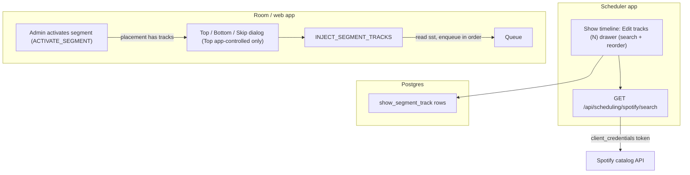

# Segment-attached track lists

## Goal

- In the scheduler, admins curate an **ordered, searchable** list of tracks for a segment as it appears on a specific show.
- When that segment is activated from a room, the activating admin is prompted: **add these tracks to the Top or Bottom of the queue, or Skip**.
- The prompt only appears when the activated placement actually has tracks, so segments without tracks stay noise-free without any extra opt-in.

## Key design decisions

- **No segment-level flag.** Every segment placement in the show timeline gets an "Edit tracks (N)" button; the activation prompt simply keys off whether the placement has >=1 track. This avoids the noisy modal without an extra `playlistEnabled` toggle.
- **Tracks stored per `show_segment` placement** (not on the segment row), keyed by `show_segment.id`: a recurring segment (e.g. the Guess the Tune segment) gets distinct songs per show with no cross-show collisions, and the **same segment can appear multiple times in one show** (e.g. several Guess the Tune rounds) each with its own track list.
- **Activation is placement-based.** Today activation is keyed by `segmentId`, which is ambiguous (and buggy: duplicate React keys / double highlight) when a segment is placed more than once. We thread the placement id (`showSegmentId`) through the snapshot and the activation path, add `room.activeShowSegmentId` (keeping `activeSegmentId` for existing consumers), and look up tracks by `showSegmentId`.
- **Activation prompt fires when** the active segment's placement has >=1 track. Works in both playback modes; the **Top** option is only offered for **app-controlled** rooms (Spotify's queue is append-only, so Top can't be guaranteed in spotify-controlled mode), while **Bottom** works in both.
- **Scheduler track search uses an app-level Spotify token** (client-credentials), configured via the existing `SPOTIFY_CLIENT_ID`/`SPOTIFY_CLIENT_SECRET` env vars. Search-only is all the scheduler needs: results (full `MetadataSourceTrack`) are stored at curation time, and track injection later resolves through the room creator's metadata source in the room context. No per-user OAuth, no Settings tab. The publish flow's room-creator OAuth can't be reused here because curation happens before any room exists.

## Data flow

## 1. Database (`packages/db`)

- Add new table `show_segment_track` keyed to `show_segment.id` (cascade delete), mirroring the existing `room_playlist_track` shape:
  - `id`, `showSegmentId` (FK), `position int`, `title`, `mediaSourceType`, `mediaSourceTrackId`, `spotifyTrackId`, `trackPayload jsonb` (full `MetadataSourceTrack` for display + re-queue), timestamps.
  - `unique(showSegmentId, position)`, index on `showSegmentId`.
- Add Drizzle relations (`showSegment` -> many `showSegmentTrack`).
- Generate a new migration (next number after `0006`) via the repo's drizzle workflow.

**Notes (2026-06-25):** Migration `0007_cloudy_thanos.sql`. Added `created_at` / `updated_at` on `show_segment_track` (plan listed "timestamps" vaguely; omitted `playedAt`/`addedAt`/`tidalTrackId` from `room_playlist_track` since segment tracks are pre-curated, not post-show playback rows).

## 2. Types (`packages/types/Scheduling.ts`)

- Add `tracks?: ShowSegmentTrackDTO[]` to `ShowSegmentDTO`.
- New `ShowSegmentTrackDTO` (position, title, source ids, payload).

**Notes (2026-06-25):** `ShowSegmentTrackDTO` includes `createdAt`/`updatedAt` ISO strings and `trackPayload: MetadataSourceTrack | null` (typed import from `./MetadataSource`).

## 3. Server: scheduling CRUD + search

- [packages/server/services/SchedulingService.ts](packages/server/services/SchedulingService.ts): include `tracks` (keyed by `show_segment.id`) when loading `show_segment` (in `findShowById`); add `setShowSegmentTracks(showSegmentId, orderedTracks[])` (replace-all) and `findShowSegmentTracks(showSegmentId)` (by placement id, unambiguous even when a segment is placed multiple times).
- [packages/server/routes/schedulingRouter.ts](packages/server/routes/schedulingRouter.ts):
  - `PUT /api/scheduling/show-segments/:id/tracks` (body: ordered track list) for curation.
  - `GET /api/scheduling/spotify/search?q=` for track search (behind existing `requireAdmin`).
- New app-token helper in `packages/adapter-spotify` (e.g. `getSpotifyClientCredentialsToken()`), mirroring the fetch in [packages/adapter-spotify/lib/operations/refreshSpotifyAccessToken.ts](packages/adapter-spotify/lib/operations/refreshSpotifyAccessToken.ts) but `grant_type=client_credentials`, with in-memory caching until expiry. Search via `SpotifyApi.withAccessToken` (pass a `market`, e.g. `US`, since client-credentials results can otherwise look unavailable). Normalize to `MetadataSourceTrack[]` using the existing `trackItemSchema`. Returns a clear error if `SPOTIFY_CLIENT_ID`/`SPOTIFY_CLIENT_SECRET` are unset.

**Notes (2026-06-25):** `searchSpotifyCatalog` in `lib/catalogSearch.ts`; routes `PUT /show-segments/:id/tracks` and `GET /spotify/search`. Server uses dynamic import of `catalogSearch` to avoid a static circular dep with `@repo/adapter-spotify`. Added `SetShowSegmentTracksRequest` to types. `findShowById` always includes `tracks` on each placement (empty array when none).

## 4. Scheduler UI (`apps/scheduler`)

- In the show detail timeline [ShowTimeline.tsx](apps/scheduler/src/components/shows/ShowTimeline.tsx): render an **"Edit tracks (N)"** button on every placement row that opens a new `SegmentTrackPicker` drawer (N = current attached track count). The picker and the `PUT` target are keyed by the placement id (`showSegment.id`). Note: the timeline currently keys rows and the dnd sortable by `segmentId` (e.g. `key={showSeg.segmentId}`, `useSortable({ id: showSegment.segmentId })`), which breaks when a segment is placed twice; switch these to `showSegment.id` as part of this work.
- New `SegmentTrackPicker` drawer: debounced search input -> `GET /spotify/search`, add results to an ordered list, reorder via the already-present `@dnd-kit/react`, remove rows, Save -> `PUT /show-segments/:id/tracks`.
- Add API client functions + a `useShowSegmentTracks` hook (TanStack Query), following [apps/scheduler/src/lib/api.ts](apps/scheduler/src/lib/api.ts) and existing hooks.

**Notes (2026-06-25):** `SegmentTrackPicker` drawer + `useSaveShowSegmentTracks` / `useSpotifyTrackSearch`. Timeline reorder/remove now uses placement ids (`showSegment.id`) so duplicate segment placements work for DnD; published shows open the drawer read-only (view tracks, no search/save).

## 5. Placement-based activation identity (`packages/server` + `apps/web`)

This makes activation handle a segment placed multiple times in one show, and is a prerequisite for per-placement track lookup. It also fixes the existing duplicate-key/double-highlight bug.

- **Room state**: add `activeShowSegmentId?: string | null` to [packages/types/Room.ts](packages/types/Room.ts). Keep `activeSegmentId` (set both on activation).
- **Snapshot**: include `showSegmentId: ss.id` per row in `buildRoomScheduleSnapshotPayload` ([scheduleRedisSnapshot.ts](packages/server/operations/scheduleRedisSnapshot.ts)) and add it to the segment entry type in `RoomScheduleSnapshotDTO` ([packages/types/Scheduling.ts](packages/types/Scheduling.ts)). Carry it through `snapshotToShowDTO` ([apps/web/src/lib/snapshotToShow.ts](apps/web/src/lib/snapshotToShow.ts)).
- **Activation contract**: `ACTIVATE_SEGMENT` / `SET_ACTIVE_SEGMENT` payload gains `showSegmentId`; pass it through [adminMachine.ts](apps/web/src/machines/adminMachine.ts), [adminController.ts](packages/server/controllers/adminController.ts), and [adminHandlersAdapter.ts](packages/server/handlers/adminHandlersAdapter.ts). `activateRoomSegment` accepts `showSegmentId`, looks up the placement by `ss.id` (not first-by-segmentId), and sets both `activeSegmentId` and `activeShowSegmentId`. Keep backward compatibility: if only `segmentId` arrives (stale client/snapshot), fall back to the first placement.
- **Web panel** ([RoomSchedulePanel.tsx](apps/web/src/components/RoomSchedulePanel.tsx)): key rows by `showSegmentId`, highlight Active by `room.activeShowSegmentId === ss.id`, and send `showSegmentId` on Activate.

## 6. Queue injection (`packages/server` + `apps/web`)

- [packages/server/operations/activateRoomSegment.ts](packages/server/operations/activateRoomSegment.ts): after successful activation, if the active placement has tracks, signal the activating client. Emit a **targeted** socket event to the activating admin (e.g. `SEGMENT_TRACKS_AVAILABLE` with `{ showSegmentId, segmentTitle, count, allowTop }`, where `allowTop = isAppControlledPlayback(room)`) from the handler [adminHandlersAdapter.ts](packages/server/handlers/adminHandlersAdapter.ts) so only that admin is prompted (not all room members).
- New socket event `INJECT_SEGMENT_TRACKS` `{ showSegmentId, placement: "top" | "bottom" }`: register in [adminController.ts](packages/server/controllers/adminController.ts), handle in `adminHandlersAdapter.ts`. Reject `top` for spotify-controlled rooms.
- New operation `injectSegmentTracksToQueue({ roomId, showSegmentId, placement })`:
  - Loads stored tracks via `SchedulingService.findShowSegmentTracks(showSegmentId)`.
  - Enqueues in stored order by **re-resolving each track through the room's Spotify metadata source** via `DJService.queueSongAs(roomId, attribution, storedSpotifyTrackId, { runPluginValidation: false })`. Stored payload is used only for scheduler display, not to build the live `QueueItem`. In spotify-controlled mode `queueSongAs` also forwards to the Spotify queue; in app-controlled it is Redis-only.
  - **Attribution**: synthetic plugin-style `QueueItemAttribution` `{ type: "plugin", pluginName: "scheduler", displayName: <segment title> }` so the queue shows the segment as the source rather than the activating admin. (Verify during build that the queue UI renders plugin/non-user attribution; plugins already queue this way.)
  - **Plugin validation skipped** (`runPluginValidation: false`): this is an admin bulk action and should bypass per-user limits / voting gates.
  - **Duplicates**: `queueSongAs` already rejects tracks already in the queue; injection skips those, continues, and reports how many were added vs skipped.
  - For `bottom` (both modes): enqueue sequentially (ascending `addedAt` preserves order). For `top` (app-controlled only): enqueue then place at the head in order via the existing `moveTrackTo(..., "top")` in reverse, or by assigning ZSET scores below the current head. Top inserts after the currently-playing/dispatched track and never interrupts it.
  - **Re-activation is stateless**: every activation re-prompts; dedup makes re-injection near-idempotent.
  - Emits `QUEUE_CHANGED`.
- Web: in [RoomSchedulePanel.tsx](apps/web/src/components/RoomSchedulePanel.tsx) / [adminMachine.ts](apps/web/src/machines/adminMachine.ts), on `SEGMENT_TRACKS_AVAILABLE` show a Top / Bottom / Skip dialog (same ad-hoc `DialogRoot` pattern already used for the preset merge/replace/skip dialog); hide the **Top** option when `allowTop` is false. On choice (non-skip) send `INJECT_SEGMENT_TRACKS { showSegmentId, placement }`.

## 7. Keep studio-bridge + docs in sync

- Add the new socket events to [apps/studio-bridge/src/server.ts](apps/studio-bridge/src/server.ts) (per AGENTS.md) so Game Studio preview stays consistent.
- Write a new ADR in `docs/adrs/` (next number) covering segment-attached track lists + client-credentials (app-token) scheduler search, and update the ADR index.

## Out of scope / notes

- Both playback modes support injection. **Bottom** works everywhere; **Top** is app-controlled only because Spotify's queue API is append-only (no insert/reorder).
- Spotify-only track source for now (the only catalog search wired). Other metadata sources can be added later.
- Scheduler search is search-only via a client-credentials app token (env-configured). If we later want to curate from your own saved tracks/playlists or create playlists directly from the scheduler, revisit a singleton OAuth flow.
- No separate "pick which playlist" step: the list bound to the active segment-on-this-show is what gets offered, keeping activation to a single Top/Bottom/Skip choice.
- A segment may be placed multiple times in one show (e.g. several Guess the Tune rounds), each with its own track list. Everything is keyed by the placement id (`show_segment.id`); the activation refactor in section 5 is what makes this unambiguous, and it also fixes the pre-existing duplicate-key/double-highlight behavior in both the room schedule panel and the scheduler timeline.