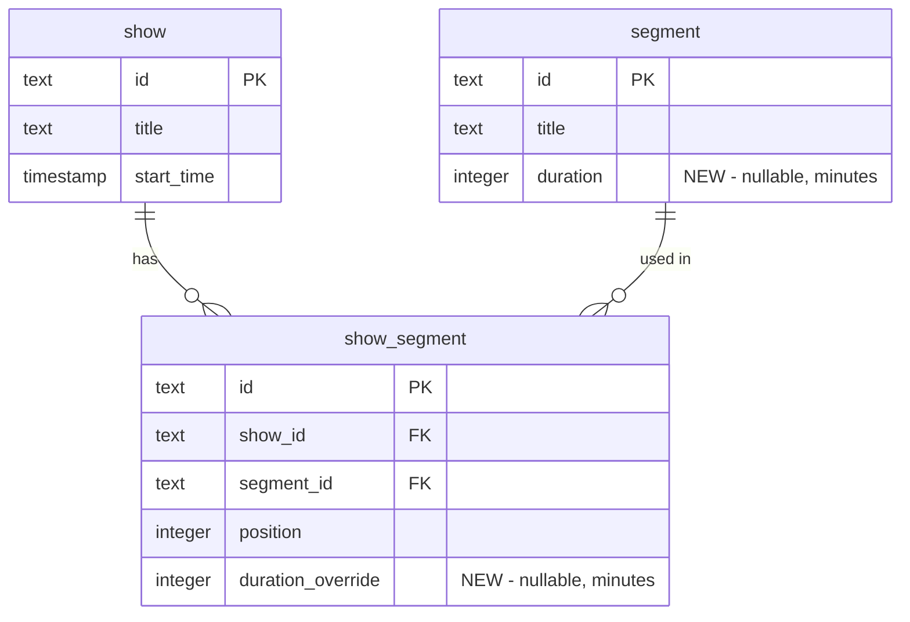

# Segment Duration Feature

## Data Model

Add two new nullable integer columns (value in **minutes**):

- `segment.duration` -- the segment's default approximate duration
- `show_segment.duration_override` -- per-show override; effective duration = `durationOverride ?? segment.duration`

No new tables. The override lives on the existing `show_segment` join, which is invisible to the user -- they just see an editable duration field on each timeline item.



## Changes By Layer

### 1. Database Schema + Migration

**[packages/db/src/schema/scheduling.ts](packages/db/src/schema/scheduling.ts)**

- Add `duration: integer("duration")` to the `segment` table (line 51, after `isRecurring`)
- Add `durationOverride: integer("duration_override")` to the `show_segment` table (line 86, after `position`)

Then run `npx drizzle-kit generate` in `packages/db/` to create migration `0002_*.sql`.

### 2. Shared Types

**[packages/types/Scheduling.ts](packages/types/Scheduling.ts)**

- `SegmentDTO`: add `duration: number | null`
- `ShowSegmentDTO`: add `durationOverride: number | null`
- `CreateSegmentRequest`: add `duration?: number | null`
- `UpdateSegmentRequest`: add `duration?: number | null`

### 3. Service Layer

**[packages/server/services/SchedulingService.ts](packages/server/services/SchedulingService.ts)**

- `createSegment` / `updateSegment`: handle `duration` field
- `findShowById`: already uses relational query that returns all `show_segment` columns, so `durationOverride` will be included automatically. Map it into the response shape.
- `reorderShowSegments`: currently deletes all rows and re-inserts. Must **preserve existing `durationOverride` values** by reading them before delete and re-applying during insert (keyed by `segmentId`).
- New function: `updateShowSegmentDuration(showId, segmentId, durationOverride)` -- updates the `duration_override` column on the matching `show_segment` row.

### 4. REST Router

**[packages/server/routes/schedulingRouter.ts](packages/server/routes/schedulingRouter.ts)**

- New endpoint: `PATCH /shows/:showId/segments/:segmentId` -- calls `updateShowSegmentDuration`. Accepts `{ durationOverride: number | null }`.

### 5. API Client

**[apps/scheduler/src/lib/api.ts](apps/scheduler/src/lib/api.ts)**

- New function: `updateShowSegmentDuration(showId, segmentId, durationOverride)` -- `PATCH api/scheduling/shows/${showId}/segments/${segmentId}`

### 6. React Hooks

**[apps/scheduler/src/hooks/useShows.ts](apps/scheduler/src/hooks/useShows.ts)**

- New hook: `useUpdateShowSegmentDuration` -- mutation that calls the new API endpoint, with optimistic update on the show detail cache (updates the matching `ShowSegmentDTO.durationOverride` in place).

### 7. Frontend UI

**[apps/scheduler/src/components/shows/ShowTimeline.tsx](apps/scheduler/src/components/shows/ShowTimeline.tsx)** (main changes)

- Accept `showStartTime: string` prop
- Compute cumulative start times: each segment's start = `showStartTime + sum of previous effective durations`
- Display estimated start time in the timeline gutter (e.g., "8:00 PM", "8:30 PM")
- Display total estimated show duration at the bottom
- Add an inline editable duration field on each `TimelineItem` -- shows `durationOverride ?? segment.duration` and calls `onDurationChange(segmentId, newValue)` callback
- The field should feel like editing the segment's duration directly (transparent override). If the user clears the override, it falls back to the segment's default.

**[apps/scheduler/src/routes/shows/$showId.tsx](apps/scheduler/src/routes/shows/$showId.tsx)**

- Pass `showStartTime={show.startTime}` to `ShowTimeline`
- Wire up `onDurationChange` to `useUpdateShowSegmentDuration`
- Display estimated total duration in the show header (sum of effective durations)

**[apps/scheduler/src/components/segments/CreateSegmentModal.tsx](apps/scheduler/src/components/segments/CreateSegmentModal.tsx)**

- Add "Approx. Duration (minutes)" number input field

**[apps/scheduler/src/components/segments/SegmentDetailDrawer.tsx](apps/scheduler/src/components/segments/SegmentDetailDrawer.tsx)**

- Add "Approx. Duration (minutes)" number input field

**[apps/scheduler/src/components/segments/SegmentCard.tsx](apps/scheduler/src/components/segments/SegmentCard.tsx)** and **[apps/scheduler/src/components/shows/SegmentBrowserCard.tsx](apps/scheduler/src/components/shows/SegmentBrowserCard.tsx)**

- Show a small duration badge (e.g., "30m") when `segment.duration` is set

## Duration Input UX

- Simple number input with "min" label, allowing null (empty = no duration set)
- In the timeline, the inline duration editor shows the effective value (override or default) with a subtle indicator when it differs from the segment default (e.g., italic or a reset button)
- Clearing the override in the timeline reverts to the segment's default duration

## Estimated Start Time Calculation

```typescript
function computeStartTimes(showStartTime: Date, segments: ShowSegmentDTO[]): Date[] {
  const starts: Date[] = []
  let cursor = showStartTime.getTime()
  for (const seg of segments) {
    starts.push(new Date(cursor))
    const minutes = seg.durationOverride ?? seg.segment.duration ?? 0
    cursor += minutes * 60_000
  }
  return starts
}
```

Segments with no duration (null default, no override) contribute 0 minutes and display "--" for duration.
