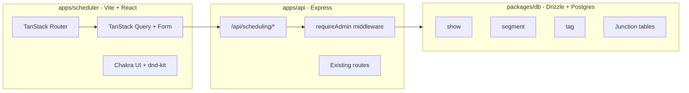

# Show Scheduling App

## Architecture Overview



---

## 1. Database Schema (`packages/db`)

New file: `[packages/db/src/schema/scheduling.ts](packages/db/src/schema/scheduling.ts)`

### Tables and Enums

**Enums** (using `pgEnum` for DB-level validation):

- `show_status`: `"working"`, `"ready"`, `"published"`
- `segment_status`: `"draft"`, `"working"`, `"ready"`, `"archived"`
- `tag_type`: `"segment"`, `"show"` (extensible for future entity types)

`**show` table:

```typescript
export const show = pgTable("show", {
  id: text("id")
    .primaryKey()
    .$defaultFn(() => createId()),
  title: text("title").notNull(),
  description: text("description"),
  startTime: timestamp("start_time", { withTimezone: true }).notNull(),
  endTime: timestamp("end_time", { withTimezone: true }),
  roomId: text("room_id"), // nullable, references Redis room (no FK)
  status: showStatusEnum("status").notNull().default("working"),
  createdBy: text("created_by")
    .notNull()
    .references(() => user.id),
  createdAt: timestamp("created_at").notNull().defaultNow(),
  updatedAt: timestamp("updated_at").notNull().defaultNow(),
})
```

`**segment` table:

```typescript
export const segment = pgTable("segment", {
  id: text("id")
    .primaryKey()
    .$defaultFn(() => createId()),
  title: text("title").notNull(),
  description: text("description"),
  isRecurring: boolean("is_recurring").notNull().default(false),
  pluginPreset: jsonb("plugin_preset"), // stores PluginPreset JSON
  status: segmentStatusEnum("status").notNull().default("draft"),
  createdBy: text("created_by")
    .notNull()
    .references(() => user.id),
  createdAt: timestamp("created_at").notNull().defaultNow(),
  updatedAt: timestamp("updated_at").notNull().defaultNow(),
})
```

`**tag` table (polymorphic via `type` column):

```typescript
export const tag = pgTable(
  "tag",
  {
    id: text("id")
      .primaryKey()
      .$defaultFn(() => createId()),
    name: text("name").notNull(),
    type: tagTypeEnum("type").notNull(),
    createdAt: timestamp("created_at").notNull().defaultNow(),
  },
  (table) => [
    unique().on(table.name, table.type), // unique per name+type combo
  ],
)
```

**Junction tables:**

- `show_segment` -- `showId`, `segmentId`, `position` (integer), composite unique on `(showId, position)`
- `segment_tag` -- `segmentId`, `tagId`, composite PK
- `show_tag` -- `showId`, `tagId`, composite PK

### Drizzle Relations

Define `relations()` in the same file for type-safe relational queries (show -> showSegments -> segment, segment -> segmentTags -> tag, etc.).

### ID Generation

Use `@paralleldrive/cuid2` (`createId()`) consistent with Better-Auth's ID pattern for the `user` table. Add as a dependency to `@repo/db`.

### Drizzle Config

Create `[packages/db/drizzle.config.ts](packages/db/drizzle.config.ts)` since none exists yet (required for `drizzle-kit generate`/`migrate`):

```typescript
import { defineConfig } from "drizzle-kit"
export default defineConfig({
  schema: "./src/schema/*",
  out: "./drizzle",
  dialect: "postgresql",
  dbCredentials: { url: process.env.DATABASE_URL! },
})
```

### Schema Barrel Export

Update `[packages/db/src/schema/index.ts](packages/db/src/schema/index.ts)` to re-export scheduling:

```typescript
export * from "./auth"
export * from "./scheduling"
```

### Default Tag Seeds

Extend `[packages/db/src/seed.ts](packages/db/src/seed.ts)` to insert default tags:

- **Segment tags**: "Live Performance", "Interview", "DJ Set", "Discussion", "Intermission", "Opener", "Closer"
- **Show tags**: "Special Event"

---

## 2. API Layer (`packages/server`)

### Scheduling Router

New file: `[packages/server/routes/schedulingRouter.ts](packages/server/routes/schedulingRouter.ts)` -- an Express Router handling all `/api/scheduling/` endpoints.

**Show endpoints:**

- `GET    /api/scheduling/shows` -- list (query: `search`, `startDate`, `endDate`, `status`)
- `POST   /api/scheduling/shows` -- create
- `GET    /api/scheduling/shows/:id` -- get with segments and tags
- `PUT    /api/scheduling/shows/:id` -- update
- `DELETE /api/scheduling/shows/:id` -- delete
- `PUT    /api/scheduling/shows/:id/segments` -- reorder/set segment list (accepts ordered array of segment IDs)

**Segment endpoints:**

- `GET    /api/scheduling/segments` -- list (query: `search`, `status`, `tags[]`, `isRecurring`, `scheduled` tri-state)
- `POST   /api/scheduling/segments` -- create
- `GET    /api/scheduling/segments/:id` -- get with tags and show history
- `PUT    /api/scheduling/segments/:id` -- update (including status changes for Kanban drag)
- `DELETE /api/scheduling/segments/:id` -- delete

**Tag endpoints:**

- `GET    /api/scheduling/tags` -- list (query: `type`)
- `POST   /api/scheduling/tags` -- create
- `DELETE /api/scheduling/tags/:id` -- delete

### Scheduling Service

New file: `[packages/server/services/schedulingService.ts](packages/server/services/schedulingService.ts)` -- encapsulates Drizzle queries. Imports `db` from `@repo/db`. Functions like:

- `findShows(filters)`, `createShow(data)`, `updateShow(id, data)`, etc.
- `findSegments(filters)`, `createSegment(data)`, `updateSegment(id, data)`, etc.
- `reorderShowSegments(showId, segmentIds[])` -- deletes existing junction rows, inserts new ones with position indices
- `findTags(type?)`, `createTag(data)`, `deleteTag(id)`

### Mount in Server

In `[packages/server/index.ts](packages/server/index.ts)`, mount the router with `requireAdmin`:

```typescript
import { createSchedulingRouter } from "./routes/schedulingRouter"
// ...
.use("/api/scheduling", requireAdmin ?? noopMiddleware, createSchedulingRouter())
```

---

## 3. Shared Types (`packages/types`)

New file: `[packages/types/PluginPreset.ts](packages/types/PluginPreset.ts)` -- move the `PluginPreset` interface from `apps/web/src/lib/pluginPresets.ts` to `@repo/types` so both the web app and scheduler can share it. Update the web app import to use `@repo/types`.

New file: `[packages/types/Scheduling.ts](packages/types/Scheduling.ts)` -- API request/response types for the scheduling endpoints (show/segment DTOs, filter params, etc.).

---

## 4. Scheduler App (`apps/scheduler`)

### Project Setup

```
apps/scheduler/
  src/
    routes/
      __root.tsx          # ChakraProvider + auth guard layout
      index.tsx            # redirect to /segments
      segments.tsx         # Segment Kanban board
      shows/
        index.tsx          # Show list view
        $showId.tsx        # Show detail: timeline + segment browser
    hooks/
      useSegments.ts       # TanStack Query hooks (list, get, create, update, delete)
      useShows.ts          # TanStack Query hooks for shows + segment reordering
      useTags.ts           # TanStack Query hooks for tags
    components/
      segments/
        SegmentKanban.tsx          # Kanban board layout
        SegmentColumn.tsx          # Status column (droppable)
        SegmentCard.tsx            # Draggable card
        CreateSegmentModal.tsx     # TanStack Form + modal
        SegmentDetailDrawer.tsx    # TanStack Form + editable drawer
      shows/
        ShowList.tsx               # Filterable show list
        ShowFilters.tsx            # Date range + search
        CreateShowModal.tsx        # TanStack Form + modal
        ShowTimeline.tsx           # Vertical segment timeline
        SegmentBrowser.tsx         # Search/filter segments to add
        SegmentBrowserCard.tsx     # Draggable segment in browser
      layout/
        AppLayout.tsx              # Nav sidebar + content area
        NavSidebar.tsx             # Navigation links
    lib/
      api.ts                       # ky client configured for /api/scheduling
      queryClient.ts               # TanStack Query client + key factories
    main.tsx
    routeTree.gen.ts               # Generated by TanStack Router
  index.html
  vite.config.ts
  tsconfig.json
  package.json
```

### Dependencies

- `react`, `react-dom`
- `@chakra-ui/react`, `@emotion/react` -- Chakra UI v3
- `@tanstack/react-router`, `@tanstack/router-plugin` -- file-based routing
- `@tanstack/react-query` -- server state management (fetching, caching, mutations, invalidation)
- `@tanstack/react-form` -- form state management with validation
- `@dnd-kit/core`, `@dnd-kit/sortable`, `@dnd-kit/utilities` -- drag and drop
- `ky` -- HTTP client
- `@repo/auth` -- authentication (client export)
- `@repo/types` -- shared types

### Auth Guard

The root route (`__root.tsx`) wraps all content with a session check using `useSession` from `@repo/auth/client`. If not authenticated or not an admin, redirect to the web app's login page. No login UI in the scheduler app itself.

### Vite Config

- TanStack Router plugin + React plugin
- Dev server on port **8001**
- Proxy `/api` to the API server (`http://127.0.0.1:3000`)
- `envPrefix: 'VITE_'`

### Docker Compose

Add a `scheduler` service to `[compose.yml](compose.yml)` similar to the `web` service but on port 8001 and pointing at `apps/scheduler/`.

---

## 5. UI Design Details

### Segment Kanban Board (`/segments`)

```
+--------------------------------------------------+
| [+ New Segment]               [Filter by tags v]  |
+--------------------------------------------------+
| Draft      | Working    | Ready     | Archived    |
| ---------- | ---------- | --------- | ----------- |
| [Card]     | [Card]     | [Card]    | [Card]      |
| [Card]     |            | [Card]    |             |
| [Card]     |            |           |             |
+--------------------------------------------------+
```

- Each column is a **droppable** zone (dnd-kit `useDroppable`)
- Each card is **draggable** (`useDraggable`)
- Dropping a card into a column fires an `updateSegment` mutation (optimistic update via TanStack Query)
- Card shows: title, tags (as badges), recurring icon, truncated description
- Clicking a card opens the **SegmentDetailDrawer** (Chakra `Drawer`)

### Show Detail Page (`/shows/:showId`)

```
+-------------------------------+---------------------------+
| Show: "Friday Night Live"     | Segment Browser           |
| Status: [Working v]           | [Search...] [Tags v]      |
| Apr 5, 8:00 PM - 11:00 PM    | [x] Recurring only        |
|                               | ( ) All / Scheduled / New |
| Timeline (droppable)          |                           |
| ┌─────────────────────┐      | [Draggable Card]          |
| │ 1. Opening Set      │ ↕    | [Draggable Card]          |
| │    DJ Performance    │      | [Draggable Card]          |
| ├─────────────────────┤      |                           |
| │ 2. Interview: Band  │ ↕    |                           |
| │    Interview         │      |                           |
| ├─────────────────────┤      |                           |
| │ 3. Headliner Set    │ ↕    |                           |
| │    Live Performance  │      |                           |
| └─────────────────────┘      |                           |
+-------------------------------+---------------------------+
```

- Timeline is a **sortable list** (dnd-kit `SortableContext`)
- Segment browser cards are **draggable** into the timeline
- Reordering fires a `reorderShowSegments` mutation (optimistic update via TanStack Query)
- The "scheduled" filter on the browser queries segments that have/haven't been assigned to any show

---

## 6. ADR

Create `[docs/adrs/0017-scheduling-app-for-show-programming.md](docs/adrs/0017-scheduling-app-for-show-programming.md)` documenting:

- Decision to build a separate Vite app (not a route in the web app) -- intentionally disposable, cleanly separable
- Shared API server approach (extending `@repo/server`)
- TanStack Query + Form over XState for this app -- better fit for CRUD-heavy server state vs the web app's real-time socket-driven state
- Schema design choices (polymorphic tags, JSONB plugin presets, junction table for segment ordering)
- REST-first approach (no websockets initially)
