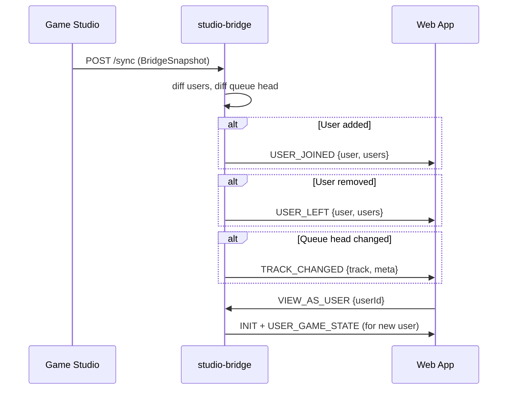

# Studio Bridge Enhancements

## Current State

The bridge syncs snapshots from Game Studio via `POST /sync` and broadcasts `USER_GAME_STATE`, `ROOM_GAME_STATE`, and `ROOM_DATA` to connected web clients. However:

- **Listeners list**: Users in `snap.users` are sent in `INIT`, but no `USER_JOINED`/`USER_LEFT` events are emitted when users are added/removed in Game Studio
- **View as**: The web client is always resolved to the first user in the snapshot (or a placeholder)
- **Now playing**: `INIT` sends `meta: { stationMeta: {} }` with no `nowPlaying`, so the UI shows "no active device"

---

## 1. User Join/Leave Events

**Goal**: When Game Studio adds/removes users, broadcast `USER_JOINED`/`USER_LEFT` so the Listeners list updates live.

**Approach**: Track previous users in the snapshot store; on each sync, diff against new users and emit appropriate events.

### Changes to [apps/studio-bridge/src/snapshotStore.ts](apps/studio-bridge/src/snapshotStore.ts)

- Store the previous `users` array (by userId) when setting a new snapshot
- Export a function `diffUsers(oldSnap, newSnap)` that returns `{ joined: User[], left: User[] }`

### Changes to [apps/studio-bridge/src/server.ts](apps/studio-bridge/src/server.ts)

In `broadcastRefresh()`, after detecting a valid snapshot change:

```typescript
const diff = diffUsers(previousSnap, snap)
for (const user of diff.joined) {
  io.to(roomSocketPath(roomId)).emit("event", {
    type: "USER_JOINED",
    data: { roomId, user, users: snap.users },
  })
}
for (const user of diff.left) {
  io.to(roomSocketPath(roomId)).emit("event", {
    type: "USER_LEFT",
    data: { roomId, user, users: snap.users },
  })
}
```

The web app's `usersMachine` already handles these events and will update the listeners list.

---

## 2. "View As" User Switching

**Goal**: Allow the web client to switch which sandbox user they are viewing as (for testing user-specific inventory, game state, etc.).

**Approach**: Add a `VIEW_AS_USER` socket event that re-resolves the user and re-emits `INIT` + `USER_GAME_STATE`.

### Changes to [apps/studio-bridge/src/server.ts](apps/studio-bridge/src/server.ts)

Add a new socket handler:

```typescript
socket.on("VIEW_AS_USER", (payload: { userId?: string; username?: string }) => {
  const snap = getBridgeSnapshot()
  if (!snap) return
  const newUser = resolveBridgeUser(snap, payload.userId, payload.username)
  socket.data.userId = newUser.userId
  socket.data.username = newUser.username
  
  // Re-emit INIT and game state for the new user
  socket.emit("event", { type: "INIT", data: buildInitPayload(snap, newUser) })
  socket.emit("event", { type: "USER_GAME_STATE", data: buildUserGameStatePayload(snap, newUser.userId) })
})
```

### Optional: Web UI for switching

Add a small dropdown/modal in the room UI (only when connected to studio-bridge) that lists available users and emits `VIEW_AS_USER`. This could be:

- A new component `ViewAsUserSelector` shown when `window.location.port === "8000"` and API is `:3099`
- Or a simpler approach: detect bridge mode and show a floating dev toolbar

For MVP, the socket event is sufficient - Game Studio or browser console can trigger it.

---

## 3. Fake Now Playing

**Goal**: Show the first queue item as "now playing" instead of the Spotify error message.

**Approach**: Build `meta.nowPlaying` from `snap.queue[0]` in `INIT` and emit `TRACK_CHANGED` when the queue head changes.

### Changes to [apps/studio-bridge/src/payloads.ts](apps/studio-bridge/src/payloads.ts)

Add a helper to build `meta` with `nowPlaying`:

```typescript
export function buildRoomMeta(snap: BridgeSnapshot): { stationMeta: object; nowPlaying: QueueItem | null } {
  return {
    stationMeta: {},
    nowPlaying: snap.queue[0] ?? null,
  }
}
```

Update `buildInitPayload` to use this:

```typescript
meta: buildRoomMeta(snap),
```

### Changes to [apps/studio-bridge/src/snapshotStore.ts](apps/studio-bridge/src/snapshotStore.ts)

Track previous queue head (`queue[0]?.mediaSource?.trackId`) to detect changes.

### Changes to [apps/studio-bridge/src/server.ts](apps/studio-bridge/src/server.ts)

In `broadcastRefresh()`, if the queue head changed:

```typescript
const prevTrackId = previousSnap?.queue[0]?.mediaSource?.trackId
const newTrackId = snap.queue[0]?.mediaSource?.trackId
if (newTrackId !== prevTrackId) {
  io.to(roomSocketPath(roomId)).emit("event", {
    type: "TRACK_CHANGED",
    data: {
      roomId,
      track: snap.queue[0] ?? null,
      meta: buildRoomMeta(snap),
    },
  })
}
```

The web app's `audioMachine` will then:
- Set `context.meta.nowPlaying` from the event
- Set `mediaSourceStatus` to `"online"` (via `setStatusFromMeta` when `nowPlaying` exists)
- `NowPlaying` component will render the track card instead of the empty state

---

## Data Flow Summary



---

## Files to Modify

| File | Changes |
|------|---------|
| `apps/studio-bridge/src/snapshotStore.ts` | Track previous snapshot for diffing users and queue |
| `apps/studio-bridge/src/payloads.ts` | Add `buildRoomMeta()`, update `buildInitPayload()` |
| `apps/studio-bridge/src/server.ts` | Emit `USER_JOINED`/`USER_LEFT`/`TRACK_CHANGED`, add `VIEW_AS_USER` handler |
