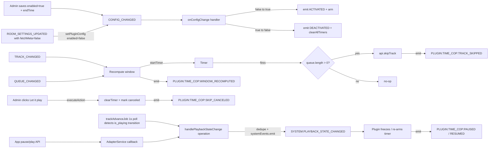

# Time Cop Plugin

## Decisions (from interview + review)

- **Standalone plugin** at `packages/plugin-time-cop/` (not part of `plugin-queue-hygiene` — different responsibility: post-enqueue playback enforcement vs. pre-enqueue rate limiting).
- **Activation model**: a single `enabled` config flag — same pattern as `plugin-queue-hygiene`. There is no `executeAction("activateTimeCop")`. The `endTime` is a sibling config field shown when `enabled === true`. The plugin's `onConfigChange` handler detects `enabled` false→true (emits `PLUGIN:TIME_COP:ACTIVATED`, arms timers) and true→false (emits `DEACTIVATED`, clears timers).
- **End time only** (no duration). Admin enters a datetime-local in the config form; client converts to **epoch ms** via `new Date(value).getTime()` before save. Server validates via Zod `superRefine`: when `enabled === true`, `endTime` must be `> now + 60s`.
- **Runtime state** (in plugin storage, not config): only the per-track ephemeral fields — `currentTrackId`, `currentDeadline`, `currentTrackSkipCanceled`, `isPaused`, `pausedRemainingMs`. "Active" is derived (`config.enabled && config.endTime != null && now < config.endTime + grace`).
- **Min playback wins**: when `(endTime - now) / remainingTracks < minPlaybackMs`, the window stretches to `minPlaybackMs` and the show overruns `endTime` (with a chat warning).
- **Cancel-skip UX**: admin-only "Let it play" button rendered in the `nowPlayingInfo` area. Saved track gets its full natural duration; remaining time is redistributed across remaining tracks. The button visibility uses a new `adminOnly?: boolean` on `ButtonComponentProps` (renderer reads `isAdmin` from the user actor); server-side `executeAction("cancelCurrentTrackSkip")` re-verifies admin role for defense in depth.
- **Pause-awareness**: a new typed `SYSTEM:PLAYBACK_STATE_CHANGED` event is added (foundational, not Time-Cop-specific). Time Cop subscribes; on pause it freezes the deadline, on resume it shifts the deadline forward by the pause duration. Wires through the `PlaybackController` `onPlay`/`onPause`/`onPlaybackStateChange` adapter callbacks (currently no-op in `AdapterService`) **AND** through `trackAdvanceJob`, which we extend to detect external Spotify pauses (host pauses on their own device) by tracking last-known `is_playing` per room and calling `handlePlaybackStateChange` on transitions. The state-probe runs for any room with a Spotify `PlaybackController`, regardless of `playbackMode`.
- **`fetchMeta` (track detection)**: Time Cop is gated on `room.fetchMeta === true`. Zod `superRefine` rejects enabling when off. If `ROOM_SETTINGS_UPDATED` flips it off mid-session, the plugin calls `setPluginConfig({ enabled: false })` (which itself fires `CONFIG_CHANGED` → `DEACTIVATED`) and posts a chat warning.
- **Room-type gating**: none beyond what `api.skipTrack` already enforces (parity with `plugin-playlist-democracy`). Works in any room with a registered playback controller.
- **Sound effects on skip**: deferred entirely (no `queueSoundEffect`, no `soundEffectOnSkipUrl` config). A follow-up will introduce a typed `SYSTEM:*` skip event and wire both browser audio and `local-remote/daemon/src/logic.rs` (Farrago) listeners at the same time, per [ADR 0014](docs/adrs/0014-emit-domain-events-from-operations-only.md).

## Architecture

Follows existing plugin patterns (see [ADR 0006](docs/adrs/0006-plugin-system-for-room-features.md), `[packages/plugin-playlist-democracy/index.ts](packages/plugin-playlist-democracy/index.ts)`):

- One `TimeCopPlugin` instance per room (`PluginRegistry` boundary).
- **No new server-side track-progress stream** — anchor everything on `QueueItem.playedAt` and `BasePlugin` timers (same as Playlist Democracy).
- `**PLUGIN:TIME_COP:`* events** are Socket-only (PluginAPI emits to `/rooms/{roomId}`). They drive client UI; they do not reach Redis or `local-remote`. This is a deliberate trade-off documented in the new ADR.




## Prerequisite: `SYSTEM:PLAYBACK_STATE_CHANGED` typed event

The `PlaybackController` adapter today fires `onPause` / `onPlay` / `onPlaybackStateChange` lifecycle callbacks (see [`packages/types/PlaybackController.ts`](packages/types/PlaybackController.ts) lines 47-51, implemented in [`packages/adapter-spotify/lib/playbackControllerApi.ts`](packages/adapter-spotify/lib/playbackControllerApi.ts) lines 62-95). They are bound in two places, both effectively no-ops:

- [`packages/server/services/AdapterService.ts`](packages/server/services/AdapterService.ts) lines 113-119 register per-room controllers with empty arrow-function callbacks.
- [`packages/server/index.ts`](packages/server/index.ts) lines 524-529 wire `this.onPlay.bind(this)` etc. on `RadioRoomServer` — but those instance methods don't exist; this is unfinished plumbing.

We complete the wiring as foundational work for Time Cop. This is decoupled from the plugin and has standalone value (any future plugin can be pause-aware).

Sub-tasks:

1. Add to [`packages/types/SystemEventTypes.ts`](packages/types/SystemEventTypes.ts):

   ```ts
   PLAYBACK_STATE_CHANGED: (data: {
     roomId: string
     state: "playing" | "paused" | "stopped"
     trackId: string | null
   }) => Promise<void> | void
   ```

2. New operation [`packages/server/operations/playback/handlePlaybackStateChange.ts`](packages/server/operations/playback/handlePlaybackStateChange.ts) — emits the system event via `context.systemEvents.emit(roomId, "PLAYBACK_STATE_CHANGED", ...)`. Per [ADR 0014](docs/adrs/0014-emit-domain-events-from-operations-only.md), domain events live in operations. **Idempotent**: stores the last-emitted state per room in Redis (`room:{roomId}:playbackState`); only emits when the new state differs. The Spotify adapter calls `onPause` AND `onPlaybackStateChange("paused")` on every pause (see `playbackControllerApi.ts:94-95`), so dedupe is essential.

3. Modify [`packages/server/services/AdapterService.ts`](packages/server/services/AdapterService.ts) `getRoomPlaybackController(roomId)` to wire the per-room callbacks to the new operation:

   ```ts
   onPause: () => handlePlaybackStateChange({ context, roomId, state: "paused" }),
   onPlay: () => handlePlaybackStateChange({ context, roomId, state: "playing" }),
   onPlaybackStateChange: (state) => handlePlaybackStateChange({ context, roomId, state }),
   ```

4. Drop the broken `this.onPlay.bind(this)` references in [`packages/server/index.ts`](packages/server/index.ts) (the global `RadioRoomServer.registerPlaybackController` path) since wiring is now per-room in `AdapterService` where `roomId` is in scope.

5. **Extend `trackAdvanceJob`** ([`packages/adapter-spotify/lib/trackAdvanceJob.ts`](packages/adapter-spotify/lib/trackAdvanceJob.ts)) to detect external pauses. The adapter callbacks only fire when **our app** calls `play()`/`pause()`; when the host pauses on their phone or desktop, nothing fires. We:

   - Generalize the early-return guard so the **state-probe** runs for any room with a Spotify `PlaybackController` registered (regardless of `playbackMode`); the existing advance-on-end logic stays gated on `isAppControlledPlayback(room)`.
   - Track last-known `is_playing` per room in Redis (or reuse the dedupe key from step 2).
   - On transition (`true → false` or `false → true`), call `handlePlaybackStateChange({ ... })`. Dedupe in the operation prevents double-fires when both the API call AND the poll detect the same change.

6. Tests: `handlePlaybackStateChange.test.ts` covering first-emit, dedupe on repeat, dedupe across `onPause`+`onPlaybackStateChange`, transition detection in `trackAdvanceJob`, missing-room.

A separate ADR [`docs/adrs/0060-playback-state-changed-system-event.md`](docs/adrs/0060-playback-state-changed-system-event.md) documents the event, the `AdapterService`-as-callback-host pattern, and the `trackAdvanceJob` polling extension.

## Files to create

- `[packages/plugin-time-cop/package.json](packages/plugin-time-cop/package.json)` — workspace package, deps on `@repo/types`, `@repo/plugin-base`, `zod`
- `[packages/plugin-time-cop/index.ts](packages/plugin-time-cop/index.ts)` — `TimeCopPlugin` class + `createTimeCopPlugin` factory
- `[packages/plugin-time-cop/types.ts](packages/plugin-time-cop/types.ts)` — Zod config schema, state shape
- `[packages/plugin-time-cop/schema.ts](packages/plugin-time-cop/schema.ts)` — `getConfigSchema()`, `getComponentSchema()`
- `[packages/plugin-time-cop/index.test.ts](packages/plugin-time-cop/index.test.ts)` — unit tests
- `[packages/plugin-time-cop/tsconfig.json](packages/plugin-time-cop/tsconfig.json)`, `[packages/plugin-time-cop/eslint.config.js](packages/plugin-time-cop/eslint.config.js)` — copy from `plugin-queue-hygiene`
- `[packages/server/operations/playback/handlePlaybackStateChange.ts](packages/server/operations/playback/handlePlaybackStateChange.ts)` and matching test — see Prerequisite section above
- `[docs/adrs/0059-time-cop-playback-window-plugin.md](docs/adrs/0059-time-cop-playback-window-plugin.md)`
- `[docs/adrs/0060-playback-state-changed-system-event.md](docs/adrs/0060-playback-state-changed-system-event.md)`

Files to modify:

- `[apps/api/src/server.ts](apps/api/src/server.ts)` — add `createTimeCopPlugin` to the `plugins:` array
- `[packages/types/Plugin.ts](packages/types/Plugin.ts)` — add `"datetime"` to `PluginConfigField.type` (the `fieldMeta` type union, alongside `duration`/`emoji`/`enum`/`url`). NOT `PluginActionFormField` — we no longer use action-button form fields.
- `[packages/types/PluginComponent.ts](packages/types/PluginComponent.ts)` — add `adminOnly?: boolean` to `ButtonComponentProps`.
- `[apps/web/src/components/Modals/Admin/PluginConfigForm.tsx](apps/web/src/components/Modals/Admin/PluginConfigForm.tsx)` — render the `datetime` field type as `<input type="datetime-local">`; serialize via `new Date(value).getTime()` to epoch ms before reporting changes through `onChange`. Display existing epoch-ms values via `new Date(ms).toISOString().slice(0, 16)`.
- `[apps/web/src/components/PluginComponents/PluginComponentRenderer.tsx](apps/web/src/components/PluginComponents/PluginComponentRenderer.tsx)` — read `isAdmin` from the user actor (e.g. via `useCurrentUser`/`useIsRoomAdmin` hook); skip rendering buttons with `adminOnly: true` for non-admins.
- `[packages/types/SystemEventTypes.ts](packages/types/SystemEventTypes.ts)` — add `PLAYBACK_STATE_CHANGED` handler entry
- `[packages/server/services/AdapterService.ts](packages/server/services/AdapterService.ts)` — wire per-room playback controller callbacks to `handlePlaybackStateChange`
- `[packages/server/index.ts](packages/server/index.ts)` — remove the broken `this.onPlay.bind(this)` references in `registerPlaybackController` (lines 524-529)
- `[packages/adapter-spotify/lib/trackAdvanceJob.ts](packages/adapter-spotify/lib/trackAdvanceJob.ts)` — generalize state-probe guard, add transition detection that calls `handlePlaybackStateChange`
- `[docs/adrs/index.md](docs/adrs/index.md)` — add rows for ADRs 0059 and 0060

## Config schema (`types.ts`)

```ts
export const timeCopConfigSchema = z
  .object({
    enabled: z.boolean().default(false),
    endTime: z.number().int().nullable().default(null), // epoch ms
    minPlaybackMs: z.number().int().min(5_000).max(300_000).default(30_000),
    warnOnOverrun: z.boolean().default(true),
  })
  .superRefine((data, ctx) => {
    if (!data.enabled) return
    if (data.endTime == null) {
      ctx.addIssue({
        path: ["endTime"],
        code: z.ZodIssueCode.custom,
        message: "End time is required when Time Cop is enabled",
      })
      return
    }
    if (data.endTime <= Date.now() + 60_000) {
      ctx.addIssue({
        path: ["endTime"],
        code: z.ZodIssueCode.custom,
        message: "End time must be at least 1 minute in the future",
      })
    }
  })

export type TimeCopConfig = z.infer<typeof timeCopConfigSchema>

// Runtime state — lives in plugin storage at key `state`. Independent of config.
export type TimeCopState = {
  currentTrackId: string | null
  currentDeadline: number | null // epoch ms
  currentTrackSkipCanceled: boolean
  isPaused: boolean
  pausedRemainingMs: number | null
}
```

`endTime` is in **config**, not runtime state — saving the form is what activates Time Cop. Per-track ephemeral fields stay in runtime state (cleared between tracks via `TRACK_CHANGED`).

## Algorithm

`isActive(config)` (helper, derived):

```ts
function isActive(config: TimeCopConfig | null): boolean {
  return !!config?.enabled && config.endTime != null && Date.now() < config.endTime + 60_000
}
```

`computeWindow(config)`:

1. `nowPlaying = await api.getNowPlaying(roomId)`
2. `queue = await api.getQueue(roomId)`
3. `remainingTracks = queue.length + (nowPlaying ? 1 : 0)`
4. If `remainingTracks === 0` → `null` (no track to arm against).
5. `naive = (config.endTime - Date.now()) / remainingTracks`
6. Return `Math.max(naive, config.minPlaybackMs)` — and post a chat warning if stretched (gated by `config.warnOnOverrun`).

`armCurrentTrack()`:

1. `config = await this.getConfig()`. If `!isActive(config)` → noop.
2. If `state.currentTrackSkipCanceled` is true → noop (admin saved this one).
3. `nowPlaying = await api.getNowPlaying(roomId)`. If null → noop.
4. `perTrack = computeWindow(config)`. If null → noop.
5. `deadline = nowPlaying.playedAt + perTrack`. If `deadline < now + 5000`, clamp to `now + 5000` (avoid insta-skip on activation mid-track).
6. `clearTimer("track:{trackId}")`.
7. If `state.isPaused`: persist `currentDeadline = deadline` and `pausedRemainingMs = deadline - now` (do NOT start the timer; resume will).
8. Else: `startTimer("track:{trackId}", deadline - now)` and persist `currentDeadline = deadline`, `pausedRemainingMs = null`.
9. Persist state, `emit("WINDOW_RECOMPUTED", { trackStartTime, perTrackWindowMs, remainingTracks, currentTrackId, isPaused, pausedRemainingMs })`.

Subscribed events:

- `TRACK_CHANGED` → reset `currentTrackSkipCanceled` and `isPaused`/`pausedRemainingMs` (a new track always starts playing per the contract of `TRACK_CHANGED`), set `currentTrackId`, `armCurrentTrack()`.
- `QUEUE_CHANGED` → `armCurrentTrack()` (window may shrink/expand).
- `PLAYBACK_STATE_CHANGED` → see pause-handler below.
- `ROOM_SETTINGS_UPDATED` → if `room.fetchMeta` flipped to false while config is enabled, call `setPluginConfig({ enabled: false })` and post a chat warning ("Time Cop disabled because Track Detection was turned off"). The resulting `CONFIG_CHANGED` event will run the deactivation path.

`onConfigChange({ config, previousConfig })` (BasePlugin's filtered `CONFIG_CHANGED`):

- Compute `wasActive = isActive(previousConfig)`, `isNowActive = isActive(config)`.
- `!wasActive && isNowActive` → activation:
  - `emit("ACTIVATED", { endTime, remainingTracks, perTrackWindowMs })`.
  - Send chat banner ("Time Cop on. Targeting {{endTime}}").
  - `armCurrentTrack()`.
- `wasActive && !isNowActive` → deactivation:
  - `clearAllTimers()`.
  - Wipe runtime state to defaults.
  - `emit("DEACTIVATED", {})`.
  - Send chat ("Time Cop off").
- `wasActive && isNowActive` and `config.minPlaybackMs !== previousConfig.minPlaybackMs` (or `endTime` changed) → re-arm:
  - `armCurrentTrack()`.

Timer callback (`track:{id}` fires):

1. **Re-read config** — bail if `!isActive(config)` (could have been disabled between scheduling and firing).
2. Re-read `getNowPlaying` to confirm `currentTrackId` still matches (stale-skip guard).
3. **Re-read state** — bail if `state.isPaused` (defense against fire-during-pause races).
4. `queue = await api.getQueue(roomId)`.
5. If `queue.length === 0` → emit `LET_IT_FINISH` (no skip on last track), persist.
6. Else `await api.skipTrack(roomId, currentTrackId)`, then `emit("TRACK_SKIPPED", { trackId, deadline, skippedAt })`.

Pause/resume handler (`PLAYBACK_STATE_CHANGED`):

- `state === "paused"` (or `"stopped"`):
  - If timer is active for `currentTrackId`: `pausedRemainingMs = currentDeadline - now`, `clearTimer("track:{trackId}")`, `state.isPaused = true`, persist, `emit("PAUSED", { isPaused: true, pausedRemainingMs })`.
- `state === "playing"`:
  - If `state.isPaused === true` and `pausedRemainingMs != null`:
    - `currentDeadline = now + pausedRemainingMs`
    - `startTimer("track:{trackId}", pausedRemainingMs)`
    - Clear `isPaused` / `pausedRemainingMs`, persist.
    - `emit("RESUMED", { isPaused: false, trackStartTime: shifted, perTrackWindowMs })` (shift `trackStartTime` so the client countdown still lands on `currentDeadline`).

`executeAction(action, initiator, params)`:

- `"cancelCurrentTrackSkip"` — verify admin: `users = await api.getUsers(roomId); if (!users.find(u => u.userId === initiator.userId)?.isAdmin) return { success: false, message: "Admins only" }`. Then set `state.currentTrackSkipCanceled = true`, `clearTimer("track:{trackId}")`, persist, `emit("SKIP_CANCELED", { trackId, by: initiator.userId })`. On the next `TRACK_CHANGED`, `armCurrentTrack` automatically redistributes the remaining time across remaining tracks (the "let it play" track consumed real wall clock, so `(endTime - now) / remainingTracks` naturally tightens for everyone else).

Plugin lifecycle:

- `register(context)`: subscribe handlers, then **rehydrate from storage**: read `state`, read `config`, if `isActive(config) && currentTrackId`, attempt `armCurrentTrack` (handles server restart). For pause-state reconciliation, query `getRoomPlaybackController().api.getPlayback()` once on register; only update `isPaused` if the controller reports a definitive `playing` (override stale paused) or `paused` with a non-null `track` (avoid the null-body false-positive — Spotify returns `state: "paused", track: null` when no active device exists, which we should treat as "unknown").

## UI components (`schema.ts`)

Following `[packages/plugin-playlist-democracy/schema.ts](packages/plugin-playlist-democracy/schema.ts)`:

Visibility uses `enabled` from config (no `state.active` flag), `currentTrackId` from store (only render when there's a track to police), `isPaused`, and `currentTrackSkipCanceled`.

```ts
components: [
  // Countdown for the current track, visible to all
  {
    id: "time-cop-countdown",
    type: "text-block",
    area: "nowPlayingInfo",
    showWhen: [
      { field: "enabled", value: true },
      { field: "isPaused", value: false },
      { field: "currentTrackSkipCanceled", value: false },
    ],
    content: [
      { type: "text", content: "Time Cop: " },
      { type: "component", name: "countdown",
        props: { startKey: "trackStartTime", duration: "perTrackWindowMs" } },
    ],
  },
  // Paused state replaces the live countdown
  {
    id: "time-cop-paused",
    type: "text-block",
    area: "nowPlayingInfo",
    showWhen: [
      { field: "enabled", value: true },
      { field: "isPaused", value: true },
    ],
    content: [
      { type: "text", content: "Time Cop paused \u2014 {{pausedRemainingMs:duration}} remaining" },
    ],
    variant: "info",
  },
  // Admin-only "Let it play" button
  {
    id: "time-cop-cancel-skip",
    type: "button",
    area: "nowPlayingInfo",
    label: "Let it play",
    icon: "Heart",
    action: "cancelCurrentTrackSkip",
    adminOnly: true,
    showWhen: [
      { field: "enabled", value: true },
      { field: "currentTrackSkipCanceled", value: false },
      { field: "isPaused", value: false },
    ],
  },
  // "Saved" badge after admin cancels a skip
  {
    id: "time-cop-saved-badge",
    type: "badge",
    area: "nowPlayingBadge",
    showWhen: { field: "currentTrackSkipCanceled", value: true },
    label: "Saved",
    variant: "success",
    icon: "Heart",
  },
],
storeKeys: [
  "trackStartTime", "perTrackWindowMs",
  "currentTrackSkipCanceled", "isPaused", "pausedRemainingMs",
]
```

The window-summary pill (e.g. "5 tracks · 12:34 left") is dropped from v1 — `nowPlayingInfo` is already busy with the countdown and cancel button, and the countdown alone communicates the time pressure. Easy to add later if it's missed.

Per [ADR 0006](docs/adrs/0006-plugin-system-for-room-features.md), the **declarative skipped track is NOT crossed out** — we deliberately do not call `augmentNowPlaying` with `obscured` or strikethrough styles (that's playlist-democracy's competitive treatment). Time Cop just removes the track from the queue via `skipTrack`; the playlist row appears as a normal short-played track.

## Config schema layout (`getConfigSchema`)

```ts
layout: [
  { type: "heading", content: "Time Cop" },
  { type: "text-block", variant: "info",
    content: "Finish the queue by a target end time. Playback windows shrink dynamically as the queue grows; tracks that exceed their window are skipped automatically." },
  "enabled",
  "endTime",
  "minPlaybackMs",
  "warnOnOverrun",
],
fieldMeta: {
  enabled: {
    type: "boolean",
    label: "Enable Time Cop",
    description: "When enabled, tracks that overrun their computed playback window will be skipped automatically.",
  },
  endTime: {
    type: "datetime",
    label: "Show ends at",
    description: "Time Cop divides the remaining time across the remaining tracks.",
    showWhen: { field: "enabled", value: true },
  },
  minPlaybackMs: {
    type: "duration",
    label: "Minimum playback time",
    description: "Tracks always play at least this long, even if it means the show overruns the end time.",
    displayUnit: "seconds",
    storageUnit: "milliseconds",
    showWhen: { field: "enabled", value: true },
  },
  warnOnOverrun: {
    type: "boolean",
    label: "Warn in chat when stretching past end time",
    showWhen: { field: "enabled", value: true },
  },
},
```

Notes:

- The `"datetime"` field type is added to `PluginConfigField.type` in `packages/types/Plugin.ts` (the `fieldMeta` type union). NOT to `PluginActionFormField` — there are no Time Cop action buttons in the config form anymore.
- The `PluginConfigForm.tsx` renderer renders datetime as `<input type="datetime-local">`, formatting epoch-ms values for display via `new Date(ms).toISOString().slice(0, 16)`. On change, parses back: `new Date(value).getTime()` (browser-local TZ implicit and correct).
- Saving the form with `enabled: true` and a valid `endTime` is what activates Time Cop — no separate button needed. `CONFIG_CHANGED` triggers the activation handler.

## Events emitted (`PLUGIN:TIME_COP:*`)


| Event               | Payload                                                                                                | Purpose                                      |
| ------------------- | ------------------------------------------------------------------------------------------------------ | -------------------------------------------- |
| `ACTIVATED`         | `{ endTime, remainingTracks, perTrackWindowMs }`                                                       | Fires once per false\u2192true `enabled` transition |
| `DEACTIVATED`       | `{ reason?: "admin" \| "fetchMeta-off" }`                                                              | Fires once per true\u2192false transition         |
| `WINDOW_RECOMPUTED` | `{ trackStartTime, perTrackWindowMs, currentTrackId, isPaused, pausedRemainingMs, currentTrackSkipCanceled }` | Drives countdown UI (covers track-arm and queue-change cases) |
| `TRACK_SKIPPED`     | `{ trackId, deadline, skippedAt }`                                                                     | Triggers any in-room reaction; informational |
| `SKIP_CANCELED`     | `{ trackId, by }`                                                                                      | Hides "Let it play", shows "Saved" badge     |
| `LET_IT_FINISH`     | `{ trackId }`                                                                                          | Last-track-in-queue notice                   |
| `PAUSED`            | `{ isPaused: true, pausedRemainingMs }`                                                                | Freeze countdown, show paused label          |
| `RESUMED`           | `{ isPaused: false, trackStartTime, perTrackWindowMs }`                                                | Re-arm countdown with shifted start time     |

`TRACK_ARMED` was collapsed into `WINDOW_RECOMPUTED` (one event for "recompute and inform clients" simplifies the client store reducer; the payload includes everything either path needs).


All consumed by `pluginComponentMachine` via `storeKeys` filtering.

## Edge cases / behaviors

- **Activation while a track is playing**: `armCurrentTrack()` clamps deadline to `now + 5s` if the computed deadline is already past, so we don't insta-skip mid-thought.
- **Activation with `endTime` in the past or `<= now + 60s`**: Zod `superRefine` rejects the form save. Admin sees the validation error inline.
- **Activation with `fetchMeta` off**: `superRefine` also rejects. (Re-checked at the field level since it's room-state, not config-state — the plugin's pre-save validation hook reads `context.getRoom()`.)
- **`fetchMeta` flipped off mid-session**: `ROOM_SETTINGS_UPDATED` handler calls `setPluginConfig({ enabled: false })`. The resulting `CONFIG_CHANGED` fires the deactivation path; chat warning is posted by the handler before disabling.
- **Empty queue with `enabled: true`**: `ACTIVATED` is emitted; `armCurrentTrack` no-ops on null queue. As soon as a track is added and `TRACK_CHANGED` or `QUEUE_CHANGED` fires, the timer arms.
- **Spotify in-app pause**: `PlaybackController.pause()` triggers `onPause` + `onPlaybackStateChange("paused")` simultaneously; dedupe-in-operation collapses to one `PLAYBACK_STATE_CHANGED` event. Plugin freezes the deadline.
- **Spotify external pause** (host pauses on phone/desktop): `trackAdvanceJob` detects `is_playing` transition on its 1s poll and calls `handlePlaybackStateChange`. Plugin freezes the deadline. Up to ~1s detection latency is acceptable.
- **Resume**: deadline shifts forward by exactly the pause duration (within 1s polling resolution). Countdown UI updates via `RESUMED` payload's shifted `trackStartTime`.
- **Talk segments without pausing playback**: if Spotify keeps playing through a talk segment, Time Cop still ticks down — by design. Admins should pause Spotify or use "Let it play".
- **Stream-only rooms (no `PlaybackController`)**: `api.skipTrack` already throws when there's no controller. Time Cop activation succeeds, but skips will surface as an error — same behavior as `plugin-playlist-democracy`. Out of scope to fix here.
- **Multiple skip plugins**: Time Cop and Playlist Democracy may both arm timers. First-to-fire wins (`api.skipTrack` is no-op on stale `trackId`). Acceptable for v1.
- **Server restart mid-show**: `register()` re-subscribes handlers, reads persisted state, and if `isActive(config) && currentTrackId`, calls `armCurrentTrack`. Pause-state reconciliation queries `getRoomPlaybackController().api.getPlayback()` once — but treats Spotify's null-body response (`state: "paused", track: null`, indicating no active device) as **unknown**, not `paused`, to avoid spuriously freezing on a fresh boot before the host's device reconnects.
- **Track skipped externally** (admin manual, item-shop scratched-cd): `TRACK_CHANGED` re-arms the next track. `currentTrackSkipCanceled` and `isPaused` are reset.
- **Stale `endTime` after a show ends**: admin must manually toggle `enabled: false` on the next visit to the config. Acceptable for v1; auto-cleanup is a deferred follow-up.

## Tests (`index.test.ts`)

Following `[packages/plugin-queue-hygiene/index.test.ts](packages/plugin-queue-hygiene/index.test.ts)` test factory style:

- `computeWindow` math (naive division, `minPlaybackMs` stretch case)
- Zod `superRefine` rejects `enabled: true` with `endTime <= now + 60s`
- Zod `superRefine` rejects `enabled: true` when room `fetchMeta === false` (or guard at the plugin layer if Zod can't see room state)
- `CONFIG_CHANGED` false→true with valid `endTime` → emits `ACTIVATED`, arms current track, sends chat
- `CONFIG_CHANGED` true→false → clears timers, wipes state, emits `DEACTIVATED`
- `CONFIG_CHANGED` with only `minPlaybackMs` change → re-arms (no `ACTIVATED`/`DEACTIVATED`)
- `ROOM_SETTINGS_UPDATED` with `fetchMeta: false` while enabled → calls `setPluginConfig({ enabled: false })` and posts chat
- `TRACK_CHANGED` re-arms; `currentTrackSkipCanceled` + `isPaused` flags reset
- `QUEUE_CHANGED` recomputes (window shrinks when track added; expands when removed)
- Timer fires → `api.skipTrack` called with correct `trackId`
- Timer fires with empty queue → no skip, emits `LET_IT_FINISH`
- Timer fires after `enabled` toggled off mid-flight (re-read config guard) → no skip
- Stale `currentTrackId` (different now-playing) → no skip
- `PLAYBACK_STATE_CHANGED: "paused"` → timer cleared, `pausedRemainingMs` captured, emits `PAUSED`
- `PLAYBACK_STATE_CHANGED: "playing"` after pause → timer re-armed with shifted deadline, emits `RESUMED`
- Pause then resume preserves total skip-or-finish moment to within ~1s tolerance
- `cancelCurrentTrackSkip` from non-admin → returns `{ success: false, message: "Admins only" }`, no state change
- `cancelCurrentTrackSkip` from admin → clears timer, sets flag, emits `SKIP_CANCELED`
- After cancel, next `TRACK_CHANGED` redistributes remaining time correctly across remaining tracks
- `register()` rehydrates state from storage and re-arms when `isActive(config) && currentTrackId`
- `register()` treats Spotify null-body `getPlayback()` (no active device) as unknown, doesn't override persisted `isPaused: false`

## ADRs

Two new ADRs:

### [`docs/adrs/0059-time-cop-playback-window-plugin.md`](docs/adrs/0059-time-cop-playback-window-plugin.md)

- **Decision**: dynamic per-track window `(endTime - now) / remainingTracks` with `minPlaybackMs` floor; admin-only "Let it play" override via `adminOnly` button; pause-aware via `SYSTEM:PLAYBACK_STATE_CHANGED`; gated on `room.fetchMeta`. Activation is a single `enabled` config flag with sibling `endTime` field; `onConfigChange` detects transitions (mirrors `plugin-queue-hygiene`).
- **Alternatives considered**:
  - Extend `plugin-queue-hygiene` (rejected — pre-enqueue rate limiting vs. post-enqueue playback enforcement are different responsibilities).
  - Action-button activation flow with form fields (rejected — adds dual-state complexity (`config.enabled` + `state.active`) and would be the only plugin not using the `enabled` checkbox idiom).
  - Per-track explicit deadlines (rejected — can't react to dynamic queue changes).
  - `SYSTEM:*` events instead of `PLUGIN:*` (deferred — Farrago/local-remote integration will introduce typed `SYSTEM:*` skip event later, per [ADR 0014](docs/adrs/0014-emit-domain-events-from-operations-only.md), and re-open `local-remote/daemon/src/logic.rs` allow-list per [ADR 0025](docs/adrs/0025-local-remote-rust-daemon.md)).
- **Consequences**:
  - admins must understand pause shifts the deadline.
  - `endTime` lingers in config after a show ends until manually disabled.
  - community-friendly UX (no strikethrough; "Saved" badge) deliberately diverges from `plugin-playlist-democracy`'s competitive treatment.

### [`docs/adrs/0060-playback-state-changed-system-event.md`](docs/adrs/0060-playback-state-changed-system-event.md)

- **Decision**: typed `SYSTEM:PLAYBACK_STATE_CHANGED` event emitted by a new `handlePlaybackStateChange` operation with Redis-backed dedupe, wired from per-room `PlaybackController` callbacks in `AdapterService` AND from `trackAdvanceJob` polling for external Spotify pauses. Replaces the broken `RadioRoomServer` global callback wiring.
- **Alternatives considered**:
  - Leave `PlaybackController` callbacks as no-ops and have plugins poll (rejected — wasteful and laggy).
  - Detect external pauses by extending the adapter's API surface only (rejected — leaves a 1s detection gap that harms UX, and the polling job already runs).
  - Plugin-private events (rejected — pause is a domain fact other consumers may want).
- **Consequences**:
  - Adapter-side dedupe is essential because Spotify's `pause()` triggers both `onPause` and `onPlaybackStateChange` simultaneously.
  - Future consumers: any plugin that wants to honor pauses; eventual `local-remote` Farrago integration.

Update [`docs/adrs/index.md`](docs/adrs/index.md) with both new rows.

## Out of scope for this PR

- All sound effects on skip — both in-room browser audio and `local-remote` Farrago. Will be introduced together via a typed `SYSTEM:*` skip event per [ADR 0014](docs/adrs/0014-emit-domain-events-from-operations-only.md), with a corresponding handler added to `apps/local-remote/daemon/src/logic.rs` (currently allow-lists only `SEGMENT_ACTIVATED`).
- Game Studio / `studio-bridge` parity — add follow-up to `apps/studio-bridge/src/server.ts` once UI lands.
- Auto-deactivate when queue runs dry (just leaves state active; admin can deactivate manually).
- Coordination with Playlist Democracy ordering (first-to-skip wins is acceptable for v1).
- Auto-cleanup of stale `endTime` after a show ends.

## Open risks (acknowledged, not blocking)

- **Multi-instance timer races**: in a horizontally scaled deployment, every API instance hosting this plugin instance will fire its own `setTimeout`. `api.skipTrack` is idempotent on stale `trackId`, so the side-effect lands once, but emitted `PLUGIN:TIME_COP:TRACK_SKIPPED` messages will multiply. Mitigations not adopted in v1: Redis-distributed lock, in-process leader election, or moving timer state into Redis with a dedicated worker. Acceptable for current single-instance prod; revisit before horizontal scaling.
- **`fetchMeta` Zod check**: `superRefine` is pure (no async/no I/O), so it can't read room state directly. Implementation will likely guard at the plugin layer (in `onConfigChange` before activating) rather than via Zod. Confirm during implementation; if the existing `validateConfig` plugin hook supports async, prefer that.
- **`adminOnly` UI gating**: client-side hiding is UX-only; server-side `executeAction` admin check is the security boundary. Both are required.
- **Spotify external-pause polling resolution**: 1s polling cadence means up to ~1s of phantom countdown drift on host-side pauses. Deemed acceptable; tighter detection requires either an event-bus from Spotify (not available) or sub-second polling (cost concern).
- **`PluginActionFormField` sunset**: this plan stops using it for Time Cop activation, but doesn't remove it (still used by other plugins). No regression.

