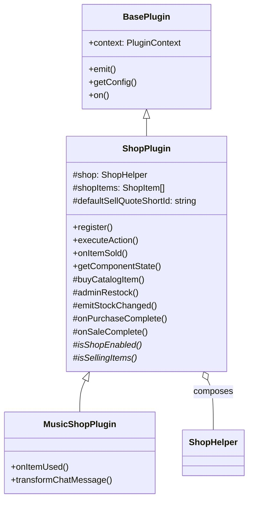

# 0045. ShopPlugin Base Class

**Date:** 2026-05-02
**Status:** Accepted

## Context

[ADR 0041](0041-game-state-tabs-and-composable-shop-helper.md) introduced `ShopHelper` as a composable utility for shop plugins, deliberately favouring composition over inheritance to keep the inheritance slot free.

In practice, after building out [`MusicShopPlugin`](../../packages/plugin-music-shop/index.ts) on top of `ShopHelper`, the same orchestration code kept reappearing inside the host plugin:

- Config guards (`if (!config.enabled)`, `if (!config.isSellingItems)`) wrapping every buy / sell / restock entry point.
- `STOCK_CHANGED` / `PURCHASE_COMPLETE` / `SALE_COMPLETE` event emissions with the same shape (`stock`, `sellPrice`, etc).
- "X bought / sold a Y for N coins" system messages.
- `executeAction` switch routing `matchBuyAction` to `purchaseCatalogItem` and the `restock` action to `restockAll`.
- An `onItemSold` implementation that always reduces to "look up user, call `shop.sell`, emit, system message".
- Subscribing to `GAME_SESSION_STARTED` to call `restockAll` + `emitStockChanged`.

Pulling these into `ShopHelper` itself was considered but rejected: the helper is a plain class with no access to `this.emit()`, `this.getConfig()`, or plugin lifecycle hooks. Wiring all of that through callbacks would defeat the readability win.

The natural home for this orchestration is a `BasePlugin` subclass. Because shop plugins typically don't also need to inherit from another base class, consuming the inheritance slot is acceptable — and they can still compose other helpers (timers, leaderboards, etc) on top.

## Decision

Introduce an abstract `ShopPlugin<TConfig>` base class in [`packages/plugin-base/ShopPlugin.ts`](../../packages/plugin-base/ShopPlugin.ts) that extends `BasePlugin<TConfig>` and **internally composes** a `ShopHelper`. Concrete shop plugins extend `ShopPlugin` instead of `BasePlugin`.



### Subclass contract

Subclasses provide:

- `shopItems: ShopItem[]` — the catalog (registered with the inventory system on `register()`).
- `isShopEnabled(config): boolean` — config guard for "plugin on at all".
- `isSellingItems(config): boolean` — config guard for "shop tab visible / purchases allowed".
- Optional overrides:
  - `defaultSellQuoteShortId` — item used to compute the `sellPrice` quote in stock snapshots (defaults to first item).
  - `buyActionPrefix` — action prefix for `matchBuyAction` (default `"buy"`).
  - `restockActionId` — admin action id (default `"restock"`, set to `null` to disable).
  - `shopClosedMessage()` / `notSellingMessage()` — user-facing strings.
  - `onPurchaseComplete()` / `onSaleComplete()` — extension hooks invoked after the standard side effects.

### Defaults provided by `ShopPlugin`

| Concern | What `ShopPlugin` does |
| --- | --- |
| `register()` | Constructs `ShopHelper`, calls `registerItems()`, subscribes to `GAME_SESSION_STARTED` for `restockAll` + `emitStockChanged`. |
| `executeAction()` | Routes `matchBuyAction` → `buyCatalogItem`, `restockActionId` → `adminRestock`, falls through to `super.executeAction`. |
| `getComponentState()` | Returns `shop.getComponentStateWithSellPrice(defaultSellQuoteShortId)`. |
| `onItemSold()` | Validates config, delegates to `shop.sell`, emits `SALE_COMPLETE` + `STOCK_CHANGED`, posts a system message, calls `onSaleComplete`. |
| `buyCatalogItem()` | Validates config, delegates to `shop.purchaseCatalogItem`, emits `PURCHASE_COMPLETE` + `STOCK_CHANGED`, posts a system message, calls `onPurchaseComplete`. |
| `adminRestock()` | Validates config, calls `shop.restockAll`, emits `STOCK_CHANGED`. |
| `emitStockChanged()` | Emits `STOCK_CHANGED` with `Record<shopStockStoreKey, number> & { sellPrice }`. |

### Standardised event payloads

`PURCHASE_COMPLETE` / `SALE_COMPLETE` payloads are unified across all shops via exported types:

```ts
export type ShopPurchaseCompletePayload = {
  userId: string
  username: string
  item: string       // shortId of the purchased item
  price: number
  stock: number      // current stock for defaultSellQuoteShortId
  sellPrice: number  // sell-back quote for defaultSellQuoteShortId
}
```

(The previous music-shop-specific `skipTokenStock` field is replaced with the generic `stock` key.)

### `MusicShopPlugin` simplification

[`packages/plugin-music-shop/index.ts`](../../packages/plugin-music-shop/index.ts) shrinks by ~150 lines. It now only declares its catalog, config guards, the config / component schemas, and the item-specific handlers (`onItemUsed`, `transformChatMessage`). All event emission, system messaging, restock plumbing, and `onItemSold` orchestration are inherited.

### `ShopHelper` is unchanged

`ShopHelper` remains a public part of `@repo/plugin-base`. Plugins that need to be both a shop and another kind of plugin (e.g. a game) can still compose it directly from `BasePlugin` rather than extending `ShopPlugin`.

## Consequences

### Positive

- **Concrete shop plugins are dramatically smaller.** `MusicShopPlugin` drops by ~40% and reads as a declarative catalog + a couple of item-specific handlers.
- **Wire format is consistent across shops.** All shop plugins emit the same shape for `PURCHASE_COMPLETE` / `SALE_COMPLETE` / `STOCK_CHANGED`, simplifying any future generic shop UI.
- **Adding a new shop is obvious.** Extend `ShopPlugin`, supply `shopItems`, `isShopEnabled`, `isSellingItems`. Override `onItemUsed` for behaviour. Done.
- **Composition is still available.** `ShopHelper` continues to be exported for plugins that don't fit the inheritance model.

### Negative / trade-offs

- **Inheritance slot consumed.** A plugin that extends `ShopPlugin` cannot extend another base class. Mitigated by the fact that `BasePlugin` is the only existing base and other capabilities are exposed as composable helpers / accessors.
- **Two patterns coexist.** Plugins can either extend `ShopPlugin` (recommended for typical shops) or compose `ShopHelper` directly. Documentation must call out when each is appropriate.
- **Legacy event keys gone.** `skipTokenStock` is replaced with the generic `stock` field. No frontend consumers exist today, so this is a safe rename.

## References

- [ADR 0006 — Plugin System for Room Features](0006-plugin-system-for-room-features.md)
- [ADR 0040 — Game Sessions and Inventory as Core Infrastructure](0040-game-sessions-and-inventory.md)
- [ADR 0041 — Game State Tabs and Composable Shop Helper](0041-game-state-tabs-and-composable-shop-helper.md) (partially superseded; tabs and `isSellingItems` convention remain in force)
- [`packages/plugin-base/ShopPlugin.ts`](../../packages/plugin-base/ShopPlugin.ts)
- [`packages/plugin-base/helpers/ShopHelper.ts`](../../packages/plugin-base/helpers/ShopHelper.ts)
- [`packages/plugin-music-shop/index.ts`](../../packages/plugin-music-shop/index.ts)
